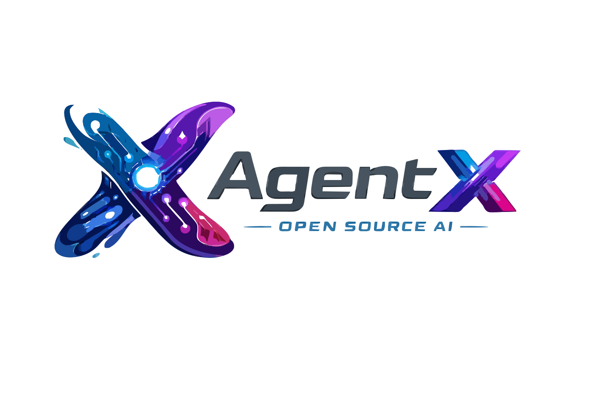
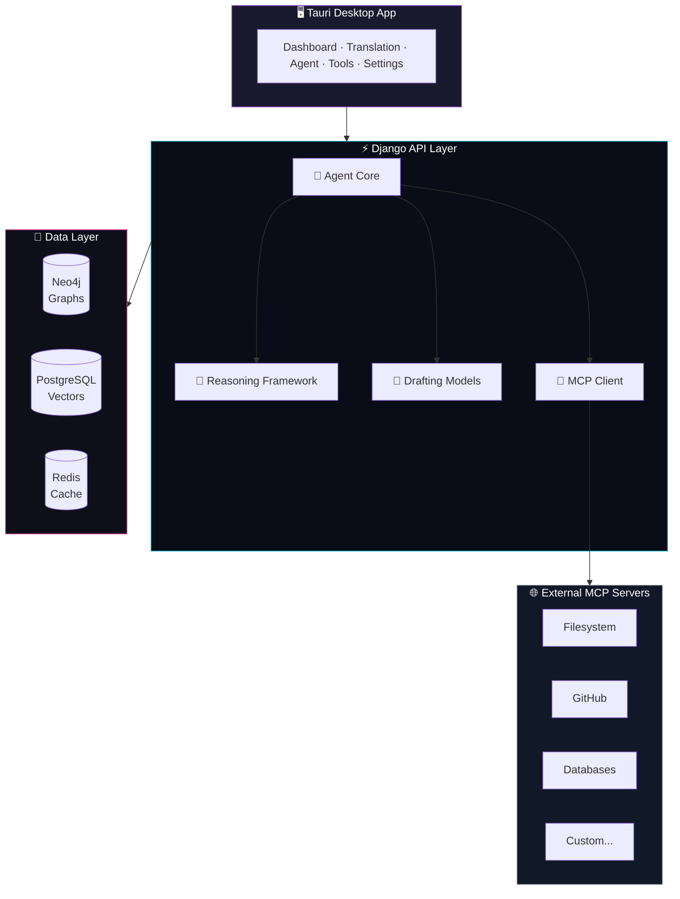

<div align="center">



# AgentX

**An AI Agent Platform for Extreme Customization**

[](https://QR-Madness.github.io/agentx/)
[](LICENSE)
[]()

---

*Multi-model orchestration • MCP tool integration • Reasoning frameworks • Memory systems*

</div>

## ✨ Features

- **🤖 Agent Core** — Task planning, execution, and context management
- **🔧 MCP Client** — Connect to external tool servers (filesystem, GitHub, databases)
- **🧠 Reasoning Framework** — Chain-of-Thought, Tree-of-Thought, ReAct, Reflection
- **📝 Drafting Models** — Speculative decoding, multi-model pipelines, candidate generation
- **🌐 Multi-Provider** — OpenAI, Anthropic, Ollama support with unified interface
- **💾 Memory System** — Neo4j graphs, PostgreSQL vectors, Redis caching
- **🌍 Translation** — 200+ languages via NLLB-200

## 🚀 Quick Start

```bash
# Clone and setup
git clone https://github.com/QR-Madness/agentx.git
cd agentx

# First-time setup (installs deps, initializes databases)
task setup

# Start development environment
task dev
```

**Prerequisites:** [Task](https://taskfile.dev), [uv](https://docs.astral.sh/uv/), [Bun](https://bun.sh), [Docker](https://docker.com)

## 📖 Documentation

<div align="center">

### **[📚 View Full Documentation →](https://QR-Madness.github.io/agentx/)**

</div>

## 🏗️ Architecture



## 🛠️ Development

| Command | Description |
|---------|-------------|
| `task dev` | Start full environment (Docker + API + Client) |
| `task test` | Run backend tests |
| `task lint` | Run linters |
| `task check` | Verify environment ready |
| `task --list` | Show all available tasks |

## 📄 License

MIT License — see [LICENSE](LICENSE) for details.

---

<div align="center">

**[Documentation](https://QR-Madness.github.io/agentx/)** · **[Issues](https://github.com/QR-Madness/agentx/issues)** · **[Discussions](https://github.com/QR-Madness/agentx/discussions)**

</div>