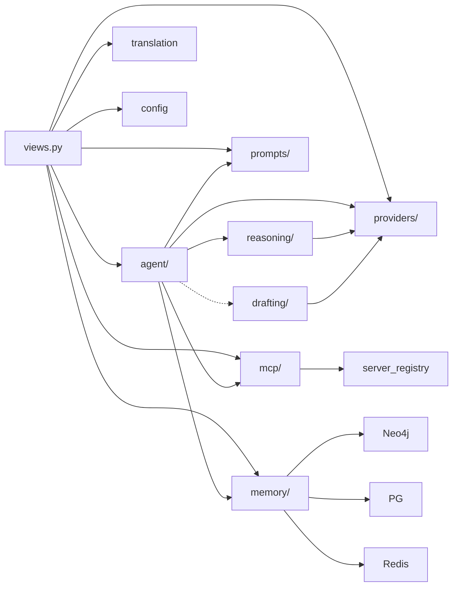

# API Layer

The Django REST API (`api/agentx_ai/`) provides all backend services. Port 12319, base URL `http://localhost:12319/api/`.

## Module Structure

```
agentx_ai/
├── views.py              # HTTP dispatch — all endpoints
├── urls.py               # URL routing (54 patterns)
├── config.py             # Runtime config (data/config.json)
├── agent/                # Agent orchestration
│   ├── core.py           #   Agent class, AgentConfig, AgentResult
│   ├── planner.py        #   TaskPlanner, TaskPlan, Subtask
│   ├── session.py        #   SessionManager, Session
│   ├── context.py        #   ContextManager, memory injection
│   └── output_parser.py  #   <think> tag extraction
├── reasoning/            # Reasoning strategies
│   ├── orchestrator.py   #   Strategy selection by task type
│   ├── chain_of_thought.py
│   ├── tree_of_thought.py
│   ├── react.py
│   └── reflection.py
├── drafting/             # Drafting strategies
│   ├── speculative.py    #   Draft + verify decoding
│   ├── pipeline.py       #   Multi-stage generation
│   └── candidate.py      #   N-best candidate voting
├── providers/            # Model provider abstraction
│   ├── base.py           #   ModelProvider ABC, Message, CompletionResult
│   ├── registry.py       #   ProviderRegistry, model→provider resolution
│   ├── lmstudio_provider.py
│   ├── anthropic_provider.py
│   └── openai_provider.py
├── mcp/                  # MCP client system
│   ├── client.py         #   MCPClientManager (scoped + persistent modes)
│   ├── server_registry.py#   ServerConfig, mcp_servers.json loader
│   ├── tool_executor.py  #   Tool dispatch and execution
│   └── transports/       #   stdio, SSE, streamable HTTP
├── prompts/              # Prompt composition
│   ├── manager.py        #   PromptManager singleton
│   ├── models.py         #   PromptProfile, PromptSection, GlobalPrompt
│   ├── loader.py         #   YAML persistence (system_prompts.yaml)
│   └── defaults.py       #   Built-in default profiles and sections
├── kit/
│   ├── translation.py    #   TranslationKit, LanguageLexicon
│   ├── memory_utils.py   #   get_agent_memory(), check_memory_health()
│   └── agent_memory/     #   Full memory system (see memory architecture)
└── utils/
    ├── decorators.py     #   @lazy_singleton, @lazy_singleton_with_fallback
    └── responses.py      #   json_success, json_error, parse_json_body, etc.
```

## Module Dependencies



## Singleton Management

Heavy subsystems are initialized lazily using `@lazy_singleton` from `utils/decorators.py`. This avoids loading models or connecting to databases at import time.

| Singleton | Location | What it wraps |
|-----------|----------|---------------|
| `get_translation_kit()` | `views.py` | `TranslationKit` — loads ~600MB HuggingFace models |
| `get_mcp_manager()` | `mcp/__init__.py` | `MCPClientManager` — starts background asyncio loop |
| `get_registry()` | `providers/__init__.py` | `ProviderRegistry` — loads `models.yaml`, probes providers |
| `get_prompt_manager()` | `prompts/__init__.py` | `PromptManager` — loads `system_prompts.yaml` |
| `get_agent_memory()` | `kit/memory_utils.py` | `AgentMemory` — connects Neo4j, PostgreSQL, Redis |

Each singleton supports:
- `get_xxx()` — create on first call, return cached thereafter
- `get_xxx.get_if_initialized()` — return instance or `None` without triggering init
- `get_xxx.is_initialized()` — boolean check
- `get_xxx.reset()` — clear cached instance (for testing)

The `@lazy_singleton_with_fallback` variant catches init exceptions and returns `None`, used for optional services like memory that may fail when databases are down.

## View Patterns

All views in `views.py` follow a consistent pattern using utilities from `utils/responses.py`:

```python
@csrf_exempt
@require_methods("POST")          # Handles OPTIONS + method enforcement
def my_endpoint(request):
    data, error = parse_json_body(request)  # Parse + validate JSON
    if error:
        return error                        # Standardized 400 response

    error = require_field(data, "name")     # Field validation
    if error:
        return error

    # ... business logic ...
    return json_success({"result": value})  # Standardized 200 response
```

Pagination uses `paginate_request(request)` which extracts `page` and `limit` query params and returns a `PaginationInfo` with `offset`, `has_next`, and a `to_dict()` method for response metadata.

## Config Management

`ConfigManager` (`config.py`) provides runtime configuration that persists to `data/config.json`:

- Hot-reloadable without server restart
- Falls back to environment variables when config values are not set
- Thread-safe with locking
- Nested structure: `providers`, `models.defaults`, `llm_settings`, `preferences`

Updated via `POST /api/config/update` with partial config dicts that are deep-merged into the existing config.

## Related

- [Architecture Overview](overview.md) — System diagrams and request lifecycle
- [API Endpoints](../api/endpoints.md) — Complete endpoint reference
- [API Models](../api/models.md) — Request/response schemas
