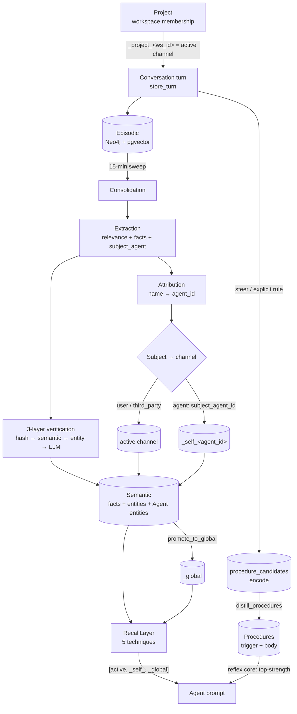

# Memory Capabilities Manifest

A single, scannable map of **what the memory system can do and how the pieces connect**.
This is the capability manifest — for the layer-by-layer build details (class signatures,
storage, indexes) see [Memory Architecture](./memory.md); for the user-facing feature
tour see [Memory (feature)](../features/memory.md).

The system is deliberately interconnected: a conversation turn flows through extraction →
consolidation → semantic facts/entities, all scoped by **channel**, and is later surfaced
by multi-technique recall. The matrix indexes every capability; the sections below explain
each one and how it feeds the others.

## Capability matrix

| Capability | Layer | Status | Entrypoint (code) | Channel scope |
|------------|-------|--------|-------------------|---------------|
| Conversation capture | episodic | shipped | `AgentMemory.store_turn` (`memory/episodic.py`) | active (+ `agent_id` on assistant turns) |
| Semantic facts & entities | semantic | shipped | `learn_fact`, `upsert_entity` (`memory/semantic.py`) | per subject |
| Procedural strategies | procedural | shipped | `record_tool_usage`, `detect_patterns` (`memory/procedural.py`) | active / `_self_` |
| Procedural distillation + reflex core | procedural | shipped | encode (`stage_procedure_candidate`) → distill (`distill_procedures`) → `learn_procedure` + `get_reflex_procedures` (`memory/procedural.py`) | `_self_{agent_id}` (corrections) / channel (rules) |
| Working memory | working | shipped | `WorkingMemory` (Redis, TTL) | active |
| Goal tracking | semantic | shipped | `add_goal` / `complete_goal` / `get_goals_for_conversation`; `TaskPlanner` | active, conversation-scoped |
| Relevance + extraction | extraction | shipped | `ExtractionService.check_relevance_and_extract[_assistant]` | — |
| Consolidation (episodic→semantic) | jobs | shipped | `consolidate_episodic_to_semantic()` (15-min) | global sweep |
| Subject-aware attribution | extraction/jobs | shipped | `_resolve_agent_attribution`, `_resolve_subject_channel` | routes to subject's channel |
| Multi-agent attribution | jobs | shipped | `_ensure_agent_entities`; Agent entities | `_self_{agent_id}` per agent |
| Fact verification (3-layer) | jobs | shipped | hash → semantic → entity-scoped → `check_contradictions` | per channel |
| Corrections / supersession | jobs | shipped | `check_correction`, `_handle_user_correction` | per channel |
| Recall (5 techniques) | recall | shipped | `RecallLayer.recall` (hybrid, entity-centric, query-expansion, HyDE, self-query) | `[active, _self_, _global]` |
| Two-stage rerank | recall | shipped | `RecallLayer._cross_encoder_stage` — 50-candidate pool → post-fusion cross-encoder, bounded demotion (cap 2); default-ON | `[active, _self_, _global]` |
| Stable salient core | recall | shipped | `AgentMemory.get_salient_core` → `get_salient_facts`/`get_salient_entities` (`memory/semantic.py`); injected as the prio-70 ledger block (`agent/context_ledger.py`) | `[active, _self_, _global]` |
| Context gating | context | shipped | `ToolOutputCompressor`, `tool_output_chunker`, trajectory compression | active |
| Structured conversation state | working | shipped | `conversation_state_storage.py`; `update_conversation_state` tool + `GET/PATCH /api/conversations/{id}/state` | conversation |
| Conversation context ledger | context | shipped | `assemble_ledger` (`agent/context_ledger.py`) — priority blocks + verbatim budget | per turn |
| State compaction (rolling digest) | context | shipped | `SessionManager.maybe_compact_to_state` → `ConversationState.digest`; `_ensure_summary_coverage` (INV-CTX-1) | conversation |
| Project memory scoping | channels | shipped | `_resolve_project_channel_workspace` (`views.py`) → `AgentConfig.memory_channel = _project_{ws_id}` | `_project_{workspace_id}` (opt-out: `memory.project_channels`) |
| Cross-channel promotion | lifecycle | shipped | `promote_to_global` | → `_global` |
| Salience decay | lifecycle | shipped | decay job (`consolidation/`) | all |
| Entity dedupe | lifecycle | shipped | `dedupe_entities` (mgmt cmd) | per/cross channel |
| Deterministic link backfill | lifecycle | shipped | `link_facts_to_entities` (`entity_linking` job) | all |
| Manual fact↔entity link | lifecycle | shipped | `link_fact_to_entity` / `unlink_fact_from_entity` (`memory/semantic.py`); `POST/DELETE /api/memory/facts/{id}/entities` | per fact |
| Agent-attribution backfill | lifecycle | shipped | `backfill_agent_attribution` (mgmt cmd) | `_self_{agent_id}` |
| Portability (export/import) | ops | shipped | `MemoryExporter` / `MemoryImporter` | per channel / `_all` |
| Debug harness | ops | shipped | `debug_attribution` (mgmt cmd) | scenario-scoped |

## How the pieces connect

## Conversation context lifecycle (per turn)

The model is **stateless between turns** — every turn the server rebuilds the whole prompt
from scratch within a token budget (`assemble_ledger`, `agent/context_ledger.py`). Blocks
compete by priority: the system prompt is mandatory, then memory (salient facts + the
structured Conversation State), then the verbatim recent transcript, then the new message;
low-priority blocks (query-driven recall) are dropped first under pressure.

<svg width="100%" viewBox="0 0 680 460" role="img" xmlns="http://www.w3.org/2000/svg" style="max-width:760px;height:auto;font-family:inherit">
<title>Per-turn context assembly and compaction</title>
<desc>The full conversation splits into recent turns kept verbatim and older turns compacted into the conversation-state digest; both feed the turn's prompt within the token budget, while every raw turn stays durable in Postgres.</desc>
<defs>
<marker id="cl-ah" markerWidth="9" markerHeight="9" refX="7" refY="3" orient="auto" markerUnits="userSpaceOnUse">
<path d="M0,0 L7,3 L0,6 Z" fill="var(--color-text-dim)"/>
</marker>
</defs>
<rect x="40" y="20" width="600" height="44" rx="8" fill="var(--color-surface-2)" stroke="var(--color-border-2)" stroke-width="1.5"/>
<text x="340" y="47" text-anchor="middle" fill="var(--color-text)" font-size="15" font-weight="600">Full conversation — every turn, oldest → newest</text>
<path d="M220,64 L190,118" fill="none" stroke="var(--color-text-dim)" stroke-width="1.6" marker-end="url(#cl-ah)"/>
<path d="M460,64 L490,118" fill="none" stroke="var(--color-text-dim)" stroke-width="1.6" marker-end="url(#cl-ah)"/>
<rect x="40" y="122" width="290" height="66" rx="8" fill="var(--color-surface-2)" stroke="var(--color-warning)" stroke-width="1.5"/>
<text x="185" y="150" text-anchor="middle" fill="var(--color-text)" font-size="14.5" font-weight="600">Older turns → Compaction</text>
<text x="185" y="171" text-anchor="middle" fill="var(--color-text-muted)" font-size="12.5">one pass, rolled into the state digest</text>
<rect x="350" y="122" width="290" height="66" rx="8" fill="var(--color-surface-2)" stroke="var(--color-accent)" stroke-width="1.5"/>
<text x="495" y="150" text-anchor="middle" fill="var(--color-text)" font-size="14.5" font-weight="600">Newest turns → kept verbatim</text>
<text x="495" y="171" text-anchor="middle" fill="var(--color-text-muted)" font-size="12.5">the recent tail that fits the budget</text>
<path d="M185,188 L300,254" fill="none" stroke="var(--color-text-dim)" stroke-width="1.6" marker-end="url(#cl-ah)"/>
<path d="M495,188 L380,254" fill="none" stroke="var(--color-text-dim)" stroke-width="1.6" marker-end="url(#cl-ah)"/>
<rect x="40" y="258" width="600" height="72" rx="8" fill="var(--color-surface-3)" stroke="var(--color-accent)" stroke-width="1.5"/>
<text x="340" y="284" text-anchor="middle" fill="var(--color-text)" font-size="15" font-weight="600">This turn's prompt · fits ≈ 90% of the model window</text>
<text x="340" y="308" text-anchor="middle" fill="var(--color-text-muted)" font-size="12.5">System prompt · Memory (facts + Conversation State + digest) · Verbatim tail · Message</text>
<path d="M340,330 L340,356" fill="none" stroke="var(--color-text-dim)" stroke-width="1.6" marker-end="url(#cl-ah)"/>
<rect x="40" y="360" width="600" height="72" rx="8" fill="var(--color-surface-2)" stroke="var(--color-ok)" stroke-width="1.5"/>
<text x="340" y="386" text-anchor="middle" fill="var(--color-text)" font-size="15" font-weight="600">Durability &amp; the contract (INV-CTX-1)</text>
<text x="340" y="408" text-anchor="middle" fill="var(--color-text-muted)" font-size="12.5">Every raw turn is also saved to Postgres — durable and searchable.</text>
<text x="340" y="424" text-anchor="middle" fill="var(--color-text-muted)" font-size="12.5">A turn leaves the live window only once the digest (or a deterministic fallback) covers it.</text>
</svg>

**What "aged out" means.** Before assembly, `_ensure_summary_coverage` walks the transcript
newest→oldest, keeping the recent tail that fits the budget (always ≥ `recent_floor`). Older
turns beyond that tail are *aged out* — dropped from the live window, but never from durable
storage (`conversation_logs` in Postgres).

**Compaction (Slice 1c, INV-CTX-1).** Aged-out turns are folded, in exactly one pass, into
`ConversationState.digest` — a **rolling** summary re-summarized in place each time (bounded
without dropping old coverage), rendered in the state block every turn
(`SessionManager.maybe_compact_to_state`). A turn leaves the window only once the digest —
or a deterministic `history_digest` fallback, if the summarizer is unavailable — covers it.
Two triggers: a post-turn pre-warm (`context.summary_trigger_ratio`, 0.85) and a just-in-time
backstop (`context.verbatim_budget_ratio`, 0.9). One pass runs per over-budget turn (state
compaction by default; the legacy prose summary is the flag-off fallback — no double-compression).

**Why rolling, not per-conversation.** Re-summarizing only the newly-aged-out turns (rather
than re-summarizing the whole window at a checkpoint) keeps compaction incremental, and —
because the digest lives beside the goals / decisions / open-threads slots — it preserves the
conversation's **active working state**, not just a narrative recap. The tradeoff is mild
summary drift over very long runs, hedged by rolling the prior digest in and by keeping the
raw turns durable.

## Capabilities by area

### Storage layers
- **Episodic** — every turn (`store_turn`) lands in Neo4j (graph) + pgvector (vectors) +
  PostgreSQL (audit log). Assistant turns carry `agent_id` + `agent_name`; this is the
  write-path contract the rest of attribution relies on. → feeds **Consolidation**.
- **Semantic** — entities, facts, and relationships. Facts link to entities via `[:ABOUT]`;
  agents are first-class entities here (see **Multi-agent attribution**). → read by **Recall**.
- **Procedural** — tool-usage trajectories and learned strategies (`detect_patterns`), plus
  **distilled procedures** (the "how we work here" delta): the encode loop stages
  `procedure_candidates` from steers/corrections + explicit user rules, the `distill_procedures`
  consolidation job mints scoped `Procedure` nodes (trigger + replayable body, strengthened not
  duplicated), and the **reflex core** (`get_reflex_procedures`) injects the top-strength ones into
  every prompt. → feeds the **Agent prompt** directly.
- **Working** — short-lived Redis context with TTL refresh.
- **Goals** — `add_goal`/`complete_goal`, linked from `TaskPlanner` so plans track intent. Each goal is stamped with the `conversation_id` that opened it, so `get_goals_for_conversation` attributes goals per conversation (surfaced in the ambassador's cross-conversation survey). Forward-looking: goals created before this carry no `conversation_id`.

### Extraction & consolidation
- **Extraction** turns raw text into candidate entities/facts in one LLM call
  (`check_relevance_and_extract`), with a separate self-knowledge extractor for assistant
  turns (`..._assistant`). It is **roster-aware**: given the conversation's agents, it
  names the specific agent a fact concerns.
- **Consolidation** (`consolidate_episodic_to_semantic`, every 15 min) sweeps unconsolidated
  turns through extraction → verification → storage. It is **global** (all pending
  conversations) — relevant when running the [debug harness](#debug-harness).

### Attribution & identity (interconnect: extraction ↔ channels ↔ semantic)
- **Subject-aware attribution** tags each fact `user | agent | third_party` and routes it to
  the matching channel, so the user's memory and an agent's self-knowledge never blend.
- **Multi-agent attribution** makes that agent-specific: the LLM names the agent
  (`subject_agent`), the server resolves the name → `agent_id` (the durable source of truth)
  in `_resolve_agent_attribution`, and `_resolve_subject_channel` homes the fact to that
  agent's `_self_{agent_id}`. Agents are registered as first-class `Entity(type="Agent")`
  in `_global` (`_ensure_agent_entities`), so facts link to them by name and survive renames
  (aliases). See [Multi-Agent](../features/multi-agent.md).

### Project scoping (interconnect: workspaces ↔ channels)
- **Project memory channels** — a conversation that belongs to a project (workspace) stores
  and recalls on `_project_{workspace_id}`, the "project" tier of the channel scope hierarchy
  (`_global → user → project → _self_ → conversation`). Knowledge learned inside a project
  stays with it; recall still layers `_self_` + `_global`, and **cross-channel promotion**
  lifts durable facts to `_global` over time. Precedence: workflow shared channel > project
  channel > profile channel; the reserved Home media space never scopes memory. Opt-out:
  config `memory.project_channels`. Resolution is best-effort
  (`_resolve_project_channel_workspace`) — memory scoping can never fail a turn.

### Verification (interconnect: extraction → semantic)
- **3-layer fact verification** gates every new fact: claim-hash → semantic-duplicate →
  entity-scoped candidates → LLM adjudication (`check_contradictions`). All checks run in the
  fact's *resolved* channel, so a correction to one agent's directive is scoped to that agent.
- **Corrections** (`check_correction`) supersede prior facts rather than duplicating them.

### Recall & retrieval (interconnect: semantic → agent prompt)
- **RecallLayer** offers five techniques (hybrid BM25+vector, entity-centric, query
  expansion, HyDE, self-query) over the channel list `[active, _self_{agent_id}, _global]`,
  so an agent sees the user's context, its own self-knowledge, and global facts together.
- **Two-stage rerank** (default-ON): stage 1 over-fetches a ~50-candidate pool
  (`recall_candidate_pool`); stage 2 reranks the fused pool with a cross-encoder
  (`cross-encoder/ms-marco-MiniLM-L-6-v2`, lazy-loaded, failure-safe) and cuts back to top-k.
  The encoder promotes freely but demotes a fused candidate at most `recall_ce_max_demotion`
  (2) positions — a hedge against encoder blind spots. Eval: +20pp MRR on the `eval_recall`
  golden set. A first-person attribution guard exists behind `recall_first_person_guard`
  (default-OFF — failed its abstention gate; see Memory-Roadmap §2.11).
- **Stable salient core** (`get_salient_core`) injects a high-priority, *maintained-not-searched*
  block of the top-salience facts/entities (cheap non-vector `ORDER BY salience`, excludes
  superseded/retired) every turn, so durable knowledge no longer depends on the current message
  matching it. The query-driven RecallLayer rides along as a lower-priority **supplement** (deduped
  against the core); the **Context Ledger** (`agent/context_ledger.py`) budgets both — see
  *Conversation Context* in `Development-Notes.md`.

### Context gating
- Oversized tool outputs are compressed and indexed (`ToolOutputCompressor`), chunked and
  queried on demand (`tool_output_chunker`), and long tool loops are compressed in-trajectory.

### Lifecycle & operations
- **Promotion** raises high-value facts to `_global`; **decay** ages salience; **dedupe**
  collapses duplicate entities (never agents — keyed by `agent_id`); **link backfill** repairs
  orphaned fact→entity edges; **agent-attribution backfill** renames legacy generic "Agent …"
  facts to the agent's name. **Portability** round-trips a user's memory as JSON. The
  **debug harness** (below) drives the whole pipeline end-to-end.

### Debug harness
- `python manage.py debug_attribution --scenario directive --agents "Mobius,Jeff"` seeds a
  scripted multi-agent conversation, runs **real** consolidation, and reports which channel
  every fact landed in (+ `[:ABOUT]` links) with ✅/❌ expectations. Non-destructive by
  default (throwaway user, scoped cleanup); `--isolate` snapshots+wipes+restores for a sterile
  read. See [Task Commands](../development/tasks.md).

## Maintaining this manifest

This manifest must stay current as mechanisms land. **When you add or change a memory
capability, update its matrix row and its section in the same PR** — and add the new
behavior to the interconnection diagram if it introduces a new edge. This page is part of
the "keep docs updated alongside code" rule in `CLAUDE.md`. A future code-side capability
registry may generate/validate this page automatically (see `Todo.md` backlog).
