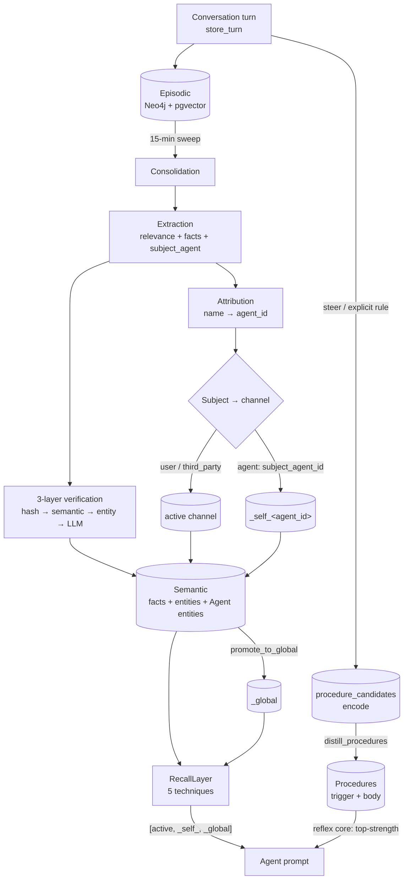

# Memory Capabilities Manifest

A single, scannable map of **what the memory system can do and how the pieces connect**.
This is the capability manifest — for the layer-by-layer build details (class signatures,
storage, indexes) see [Memory Architecture](./memory.md); for the user-facing feature
tour see [Memory (feature)](../features/memory.md).

The system is deliberately interconnected: a conversation turn flows through extraction →
consolidation → semantic facts/entities, all scoped by **channel**, and is later surfaced
by multi-technique recall. The matrix indexes every capability; the sections below explain
each one and how it feeds the others.

## Capability matrix

| Capability | Layer | Status | Entrypoint (code) | Channel scope |
|------------|-------|--------|-------------------|---------------|
| Conversation capture | episodic | shipped | `AgentMemory.store_turn` (`memory/episodic.py`) | active (+ `agent_id` on assistant turns) |
| Semantic facts & entities | semantic | shipped | `learn_fact`, `upsert_entity` (`memory/semantic.py`) | per subject |
| Procedural strategies | procedural | shipped | `record_tool_usage`, `detect_patterns` (`memory/procedural.py`) | active / `_self_` |
| Procedural distillation + reflex core | procedural | shipped | encode (`stage_procedure_candidate`) → distill (`distill_procedures`) → `learn_procedure` + `get_reflex_procedures` (`memory/procedural.py`) | `_self_{agent_id}` (corrections) / channel (rules) |
| Working memory | working | shipped | `WorkingMemory` (Redis, TTL) | active |
| Goal tracking | semantic | shipped | `add_goal` / `complete_goal`; `TaskPlanner` | active |
| Relevance + extraction | extraction | shipped | `ExtractionService.check_relevance_and_extract[_assistant]` | — |
| Consolidation (episodic→semantic) | jobs | shipped | `consolidate_episodic_to_semantic()` (15-min) | global sweep |
| Subject-aware attribution | extraction/jobs | shipped | `_resolve_agent_attribution`, `_resolve_subject_channel` | routes to subject's channel |
| Multi-agent attribution | jobs | shipped | `_ensure_agent_entities`; Agent entities | `_self_{agent_id}` per agent |
| Fact verification (3-layer) | jobs | shipped | hash → semantic → entity-scoped → `check_contradictions` | per channel |
| Corrections / supersession | jobs | shipped | `check_correction`, `_handle_user_correction` | per channel |
| Recall (5 techniques) | recall | shipped | `RecallLayer.recall` (hybrid, entity-centric, query-expansion, HyDE, self-query) | `[active, _self_, _global]` |
| Context gating | context | shipped | `ToolOutputCompressor`, `tool_output_chunker`, trajectory compression | active |
| Cross-channel promotion | lifecycle | shipped | `promote_to_global` | → `_global` |
| Salience decay | lifecycle | shipped | decay job (`consolidation/`) | all |
| Entity dedupe | lifecycle | shipped | `dedupe_entities` (mgmt cmd) | per/cross channel |
| Deterministic link backfill | lifecycle | shipped | `link_facts_to_entities` (`entity_linking` job) | all |
| Manual fact↔entity link | lifecycle | shipped | `link_fact_to_entity` / `unlink_fact_from_entity` (`memory/semantic.py`); `POST/DELETE /api/memory/facts/{id}/entities` | per fact |
| Agent-attribution backfill | lifecycle | shipped | `backfill_agent_attribution` (mgmt cmd) | `_self_{agent_id}` |
| Portability (export/import) | ops | shipped | `MemoryExporter` / `MemoryImporter` | per channel / `_all` |
| Debug harness | ops | shipped | `debug_attribution` (mgmt cmd) | scenario-scoped |

## How the pieces connect

## Capabilities by area

### Storage layers
- **Episodic** — every turn (`store_turn`) lands in Neo4j (graph) + pgvector (vectors) +
  PostgreSQL (audit log). Assistant turns carry `agent_id` + `agent_name`; this is the
  write-path contract the rest of attribution relies on. → feeds **Consolidation**.
- **Semantic** — entities, facts, and relationships. Facts link to entities via `[:ABOUT]`;
  agents are first-class entities here (see **Multi-agent attribution**). → read by **Recall**.
- **Procedural** — tool-usage trajectories and learned strategies (`detect_patterns`), plus
  **distilled procedures** (the "how we work here" delta): the encode loop stages
  `procedure_candidates` from steers/corrections + explicit user rules, the `distill_procedures`
  consolidation job mints scoped `Procedure` nodes (trigger + replayable body, strengthened not
  duplicated), and the **reflex core** (`get_reflex_procedures`) injects the top-strength ones into
  every prompt. → feeds the **Agent prompt** directly.
- **Working** — short-lived Redis context with TTL refresh.
- **Goals** — `add_goal`/`complete_goal`, linked from `TaskPlanner` so plans track intent.

### Extraction & consolidation
- **Extraction** turns raw text into candidate entities/facts in one LLM call
  (`check_relevance_and_extract`), with a separate self-knowledge extractor for assistant
  turns (`..._assistant`). It is **roster-aware**: given the conversation's agents, it
  names the specific agent a fact concerns.
- **Consolidation** (`consolidate_episodic_to_semantic`, every 15 min) sweeps unconsolidated
  turns through extraction → verification → storage. It is **global** (all pending
  conversations) — relevant when running the [debug harness](#debug-harness).

### Attribution & identity (interconnect: extraction ↔ channels ↔ semantic)
- **Subject-aware attribution** tags each fact `user | agent | third_party` and routes it to
  the matching channel, so the user's memory and an agent's self-knowledge never blend.
- **Multi-agent attribution** makes that agent-specific: the LLM names the agent
  (`subject_agent`), the server resolves the name → `agent_id` (the durable source of truth)
  in `_resolve_agent_attribution`, and `_resolve_subject_channel` homes the fact to that
  agent's `_self_{agent_id}`. Agents are registered as first-class `Entity(type="Agent")`
  in `_global` (`_ensure_agent_entities`), so facts link to them by name and survive renames
  (aliases). See [Multi-Agent](../features/multi-agent.md).

### Verification (interconnect: extraction → semantic)
- **3-layer fact verification** gates every new fact: claim-hash → semantic-duplicate →
  entity-scoped candidates → LLM adjudication (`check_contradictions`). All checks run in the
  fact's *resolved* channel, so a correction to one agent's directive is scoped to that agent.
- **Corrections** (`check_correction`) supersede prior facts rather than duplicating them.

### Recall & retrieval (interconnect: semantic → agent prompt)
- **RecallLayer** offers five techniques (hybrid BM25+vector, entity-centric, query
  expansion, HyDE, self-query) over the channel list `[active, _self_{agent_id}, _global]`,
  so an agent sees the user's context, its own self-knowledge, and global facts together.

### Context gating
- Oversized tool outputs are compressed and indexed (`ToolOutputCompressor`), chunked and
  queried on demand (`tool_output_chunker`), and long tool loops are compressed in-trajectory.

### Lifecycle & operations
- **Promotion** raises high-value facts to `_global`; **decay** ages salience; **dedupe**
  collapses duplicate entities (never agents — keyed by `agent_id`); **link backfill** repairs
  orphaned fact→entity edges; **agent-attribution backfill** renames legacy generic "Agent …"
  facts to the agent's name. **Portability** round-trips a user's memory as JSON. The
  **debug harness** (below) drives the whole pipeline end-to-end.

### Debug harness
- `python manage.py debug_attribution --scenario directive --agents "Mobius,Jeff"` seeds a
  scripted multi-agent conversation, runs **real** consolidation, and reports which channel
  every fact landed in (+ `[:ABOUT]` links) with ✅/❌ expectations. Non-destructive by
  default (throwaway user, scoped cleanup); `--isolate` snapshots+wipes+restores for a sterile
  read. See [Task Commands](../development/tasks.md).

## Maintaining this manifest

This manifest must stay current as mechanisms land. **When you add or change a memory
capability, update its matrix row and its section in the same PR** — and add the new
behavior to the interconnection diagram if it introduces a new edge. This page is part of
the "keep docs updated alongside code" rule in `CLAUDE.md`. A future code-side capability
registry may generate/validate this page automatically (see `Todo.md` backlog).
