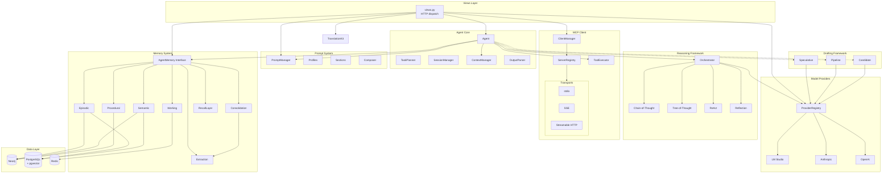
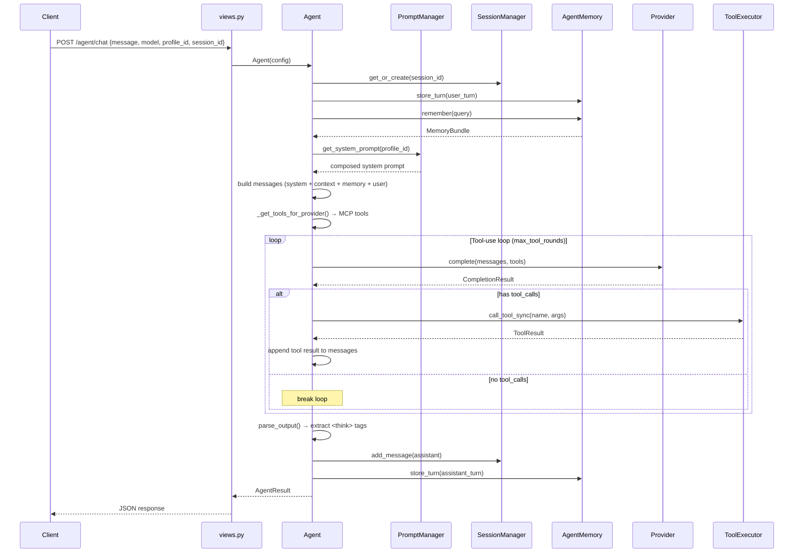

# Architecture Overview

AgentX is a two-tier system: a Django REST API backend and a Tauri desktop client. This document covers the backend architecture.

## System Architecture

## Request Lifecycle

A `POST /api/agent/chat` request follows this path:

## Module Index

| Module | Path | Purpose | Init |
|--------|------|---------|------|
| Agent | `agent/core.py` | Orchestrates reasoning, tools, memory, prompts | Per-request |
| TaskPlanner | `agent/planner.py` | Decomposes tasks into subtasks with goal tracking | Per-request |
| SessionManager | `agent/session.py` | Maintains conversation context across messages | Lazy singleton |
| ContextManager | `agent/context.py` | Token budgeting, memory injection, summarization | Per-request |
| OutputParser | `agent/output_parser.py` | Extracts `<think>` tags from model output | Stateless |
| Reasoning | `reasoning/orchestrator.py` | Selects and executes reasoning strategy | Per-request |
| Drafting | `drafting/` | Speculative decoding, pipelines, candidates | Per-request |
| Providers | `providers/registry.py` | Model-to-provider resolution, model registry | Lazy singleton |
| MCP | `mcp/client.py` | External tool server connections and execution | Lazy singleton |
| Prompts | `prompts/manager.py` | System prompt composition from profiles + sections | Lazy singleton |
| Memory | `kit/agent_memory/memory/interface.py` | Unified API for episodic/semantic/procedural/working memory | Lazy |
| RecallLayer | `kit/agent_memory/recall/layer.py` | Multi-strategy retrieval (hybrid, HyDE, entity-centric) | Per-query |
| Extraction | `kit/agent_memory/extraction/service.py` | LLM-based entity/fact extraction | Per-consolidation |
| Consolidation | `kit/agent_memory/consolidation/worker.py` | Background jobs for memory processing | Background thread |
| Translation | `kit/translation.py` | NLLB-200 translation + language detection | Lazy singleton |
| Config | `config.py` | Runtime config persistence to `data/config.json` | Lazy singleton |

## Design Decisions

**Lazy singletons** — Heavy subsystems (TranslationKit, MCP, Providers, Prompts) use `@lazy_singleton` to defer initialization until first use. Health checks can probe without triggering model loads via `get_if_initialized()`.

**Sync Django + async MCP** — Django runs synchronously. MCP client uses `asyncio` internally. The bridge is `MCPClientManager.call_tool_sync()`, which runs async tool calls on a background event loop thread. The streaming chat endpoint (`agent_chat_stream`) is the only async view.

**Per-request Agent** — Each chat/run request creates a fresh `Agent` instance with its own config. Shared state (sessions, providers, MCP connections) lives in singletons. This keeps the Agent stateless and thread-safe.

**Memory is optional** — All memory operations are wrapped in try/except. The system degrades gracefully when databases are unavailable. `enable_memory=False` skips all memory operations.
