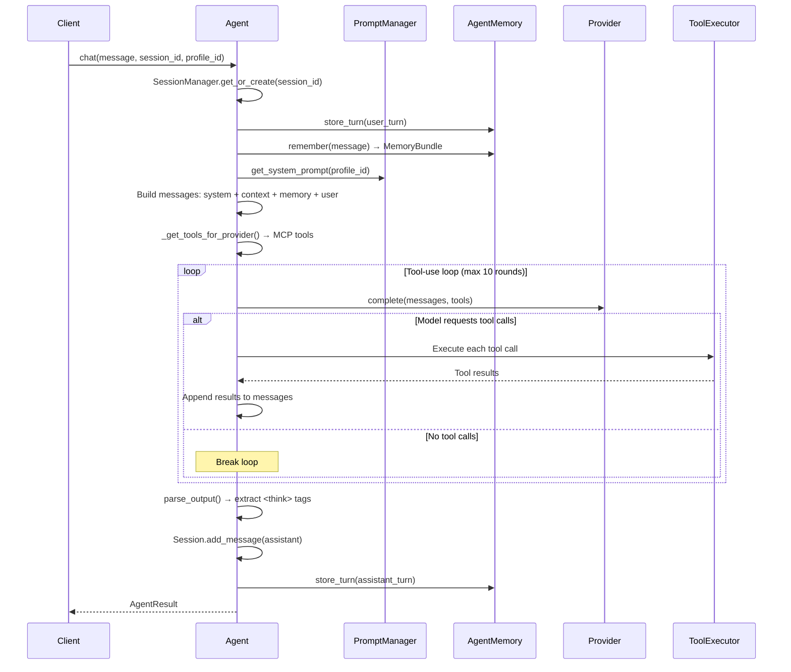
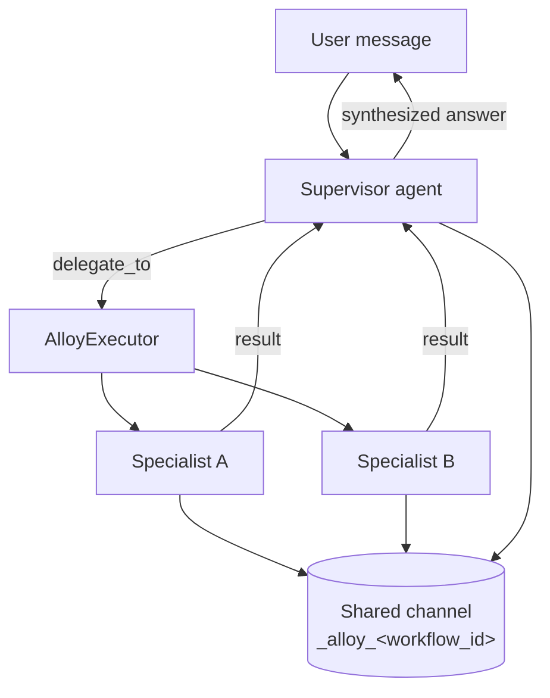
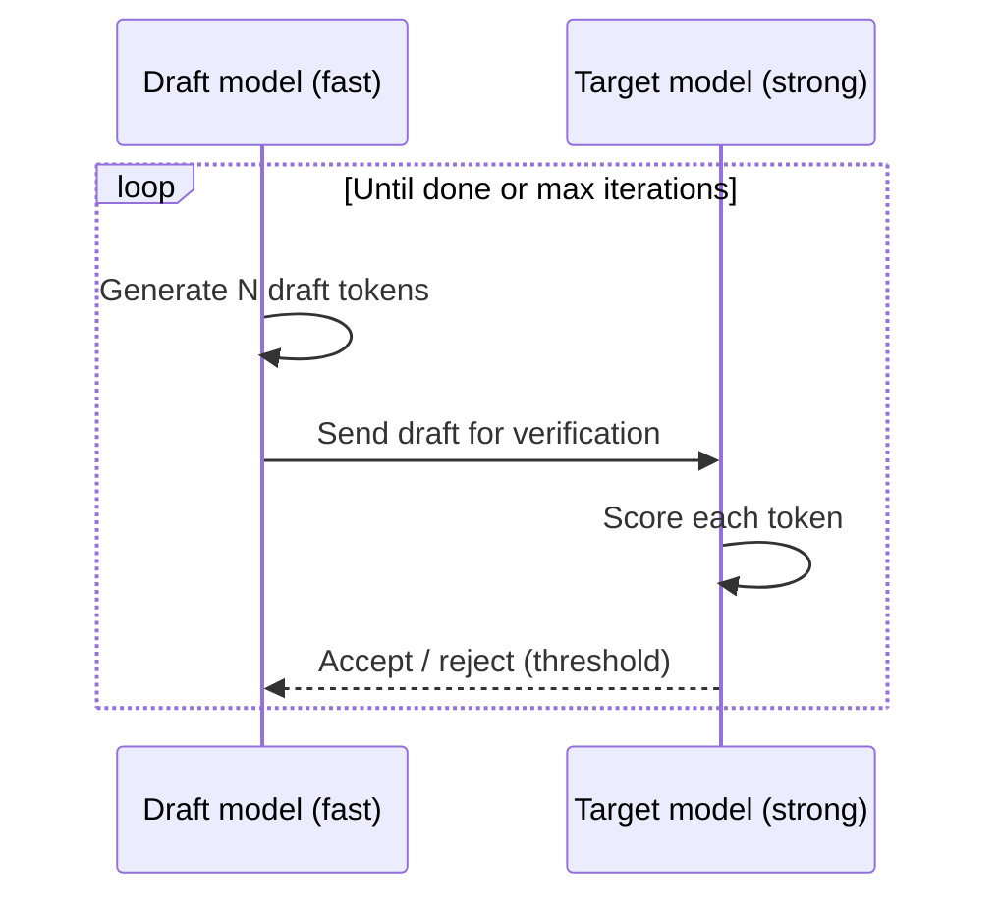
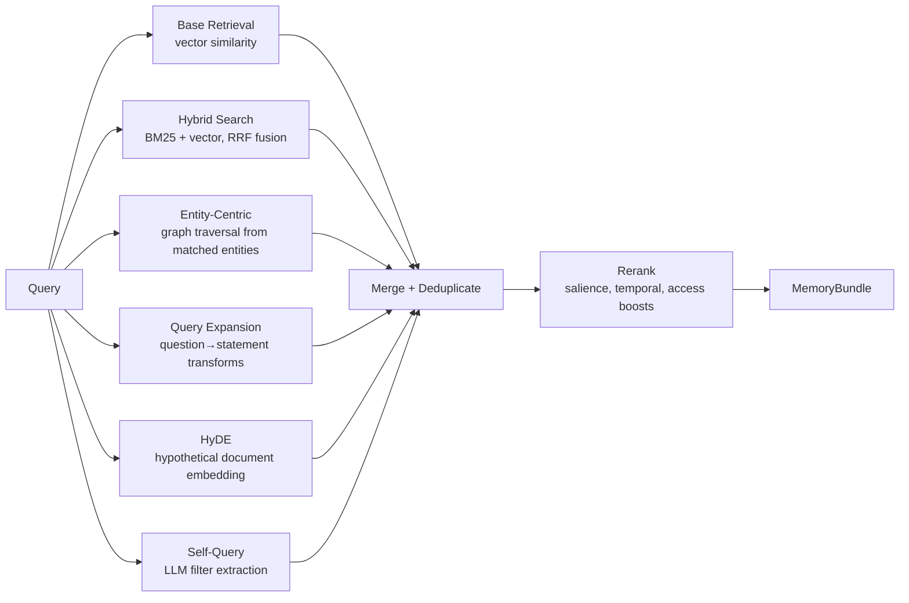
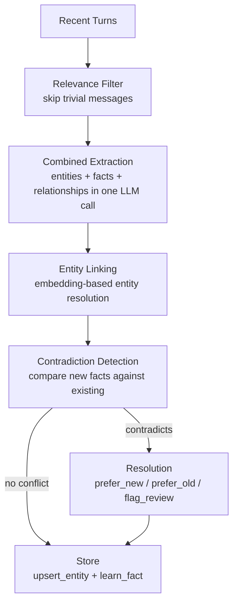

# AgX System Design

The flow diagrams behind AgentX, collected in one place. The feature pages stay readable and
link here for the deep view — this page is the map of how the parts actually move.

## The chat turn

Every message runs through one streaming pipeline: bind the session, recall memory, compose the
prompt, run a bounded tool-use loop, then parse the output and write memory back. The
day-to-day surface is on the [Chat](../features/chat.md) page.

## Multi-agent delegation

A [team](../features/multi-agent.md) puts a supervisor (the **Lead**) in charge of the
conversation. It hands focused subtasks to specialists (**Members**) through the `delegate_to`
tool, coordinated by the `AlloyExecutor` over a shared memory channel, then synthesizes their
results into one answer.

## Speculative decoding

[Drafting](../features/reasoning.md#advanced-multi-model-drafting) can pair two models on a
single generation: a fast **draft** model proposes a batch of tokens, and a stronger
**target** model verifies them — accepting or rejecting each batch against a threshold. It's
off by default; the payoff is cheaper tokens whenever the draft and target agree.

## Memory recall

Recall is more than nearest-vector lookup. The [Recall Layer](../features/memory.md#how-recall-finds-the-right-memories)
runs several complementary techniques in parallel and fuses the results, then reranks the pool
by relevance, salience, and recency before handing back a `MemoryBundle`.

## Memory consolidation

Every 15 minutes a background pass distills recent conversations into durable knowledge —
extracting entities and facts, resolving them against what's already known, and detecting
contradictions before storing. The day-to-day view is on the
[Memory](../features/memory.md#consolidation--turning-talk-into-knowledge) page.

