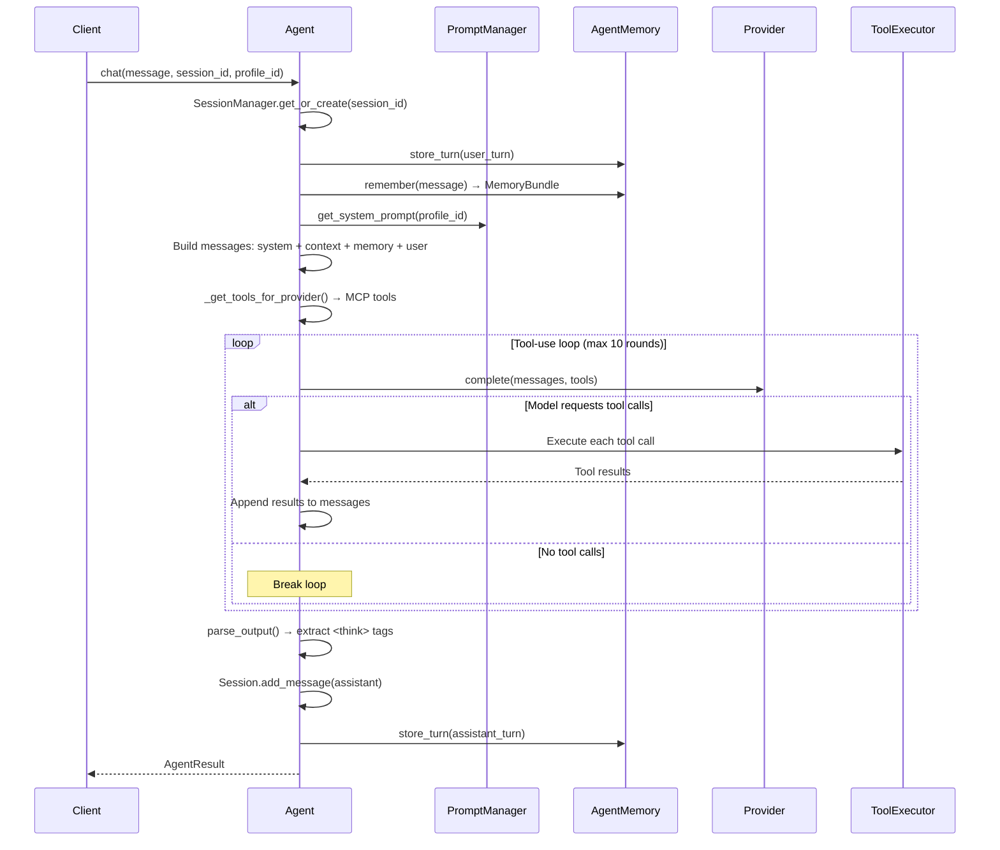
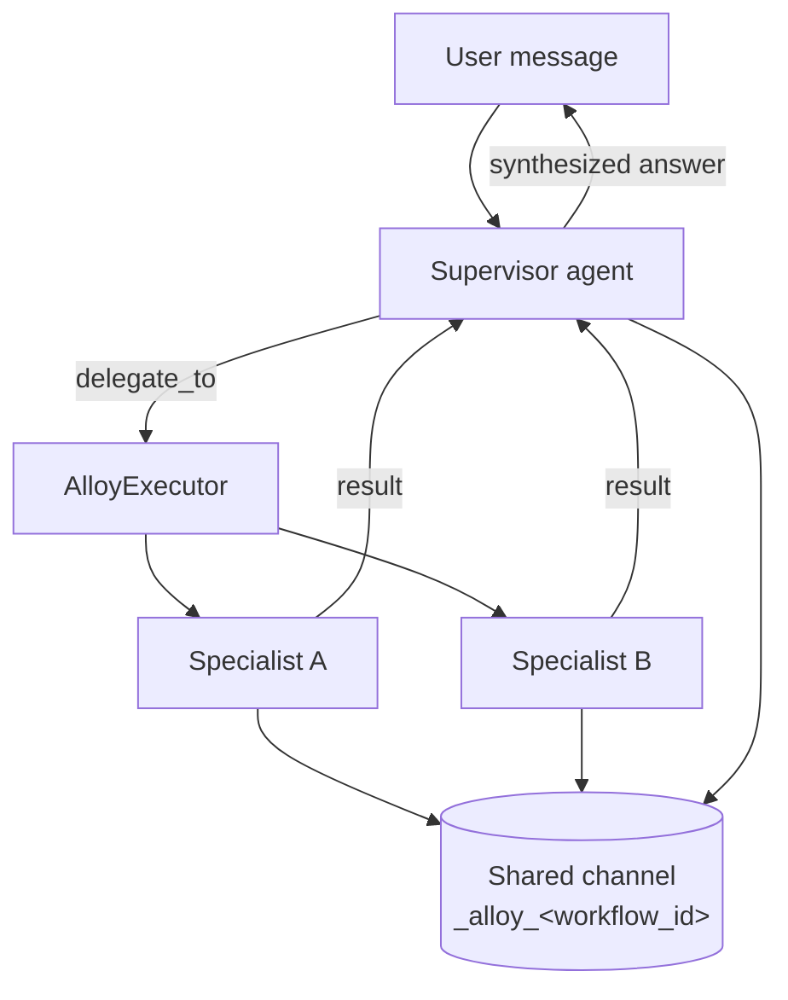

# AgX System Design

The flow diagrams behind AgentX, collected in one place. The feature pages stay readable and
link here for the deep view — this page is the map of how the parts actually move.

## The chat turn

Every message runs through one streaming pipeline: bind the session, recall memory, compose the
prompt, run a bounded tool-use loop, then parse the output and write memory back. The
day-to-day surface is on the [Chat](../features/chat.md) page.

## Multi-agent delegation

A [team](../features/multi-agent.md) puts a supervisor (the **Lead**) in charge of the
conversation. It hands focused subtasks to specialists (**Members**) through the `delegate_to`
tool, coordinated by the `AlloyExecutor` over a shared memory channel, then synthesizes their
results into one answer.

