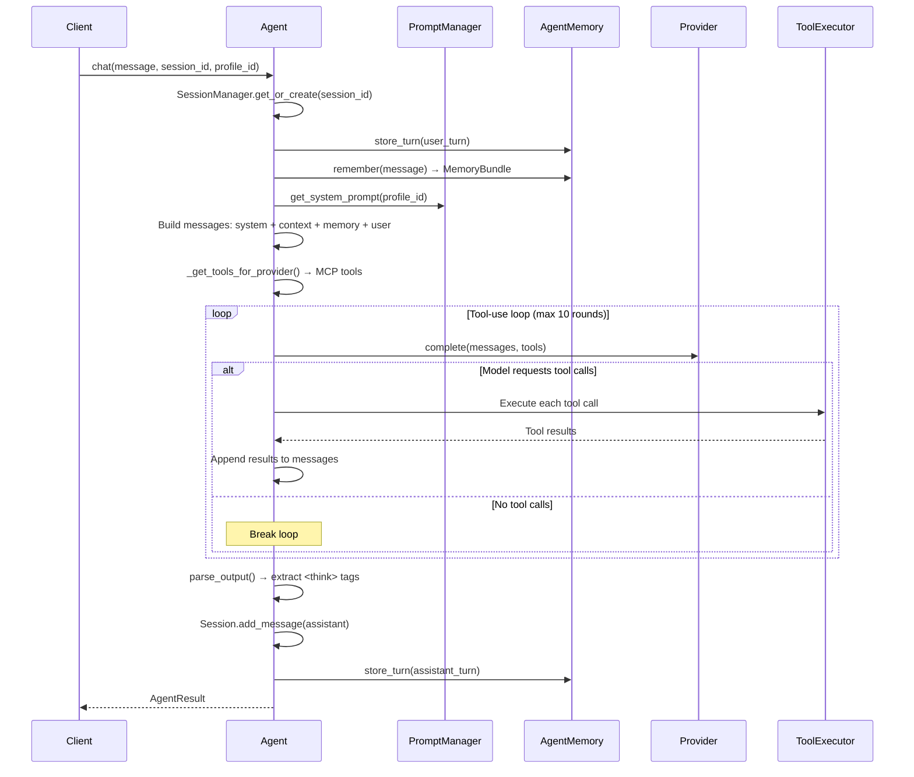

# Chat

The chat system provides multi-turn conversations with session management, memory integration, tool use, and streaming support.

## Chat Flow

## Two Modes

### Simple Mode (default for chat)

Direct provider completion without planning or reasoning. Used by `POST /api/agent/chat` and `POST /api/agent/chat/stream`.

Flow: prompt composition → provider completion → tool-use loop → output parsing → memory storage.

### Full Agent Mode

Full pipeline with task planning and reasoning. Used by `POST /api/agent/run`.

Flow: task decomposition → reasoning strategy selection → execution → memory storage.

## Streaming

`POST /api/agent/chat/stream` returns the same response as `POST /api/agent/chat`, but as
Server-Sent Events, using the same tool-use loop as the non-streaming endpoint. The run is
detached from the HTTP connection — it keeps generating server-side and persists its turns even
if the client disconnects.

Two client surfaces let a user recover a detached run after closing its tab: a **"Live runs"**
section in the Relay inbox, and a **"Resume Running"** section atop the conversation selector.
Both list only runs still `running` and not owned by an open tab; clicking **Resume** restores
the conversation and re-attaches.

See [Streaming & Detached Runs](../integrate/streaming.md) for the full SSE event reference and
the re-attach / cancel mechanics.

## Session Management

`SessionManager` maintains conversation context across messages within a session.

- Sessions are identified by `session_id` (UUID)
- If no `session_id` is provided, a new session is created
- Include the returned `session_id` in subsequent requests for continuity
- Context includes all prior messages in the session

## Memory Integration

When `use_memory` is `true` (default):

1. **Store user turn** — The user message is saved to episodic memory
2. **Recall** — `AgentMemory.remember(query)` retrieves relevant turns, facts, entities, and strategies
3. **Inject** — `ContextManager.inject_memory()` adds the `MemoryBundle` to the message context
4. **Store assistant turn** — The response is saved with model/latency metadata

Memory operations are wrapped in try/except — the system works normally if databases are unavailable.

## Prompt Composition

Each chat request composes a system prompt from:

1. **Global prompt** — Core persona (always applied)
2. **MCP tools prompt** — Auto-generated tool descriptions
3. **Profile sections** — From the selected profile (via `profile_id`)
4. **Memory context** — Injected relevant memories

See [Prompts](prompts.md) for details.

## Tool-Use Loop

When MCP servers are connected, tools are exposed to the model as function-calling tools. The agent runs a tool-use loop:

1. Provider returns a completion with `tool_calls`
2. Agent executes each tool via `ToolExecutor.call_tool_sync()`
3. Tool results are appended as tool messages
4. Provider is called again with the updated messages
5. Repeat until no more tool calls or `max_tool_rounds` (10) is reached

## Output Parsing

The `OutputParser` extracts `<think>` tags from model output:

- Content within `<think>...</think>` is separated into `AgentResult.thinking`
- `has_thinking` is set to `true` when thinking is extracted
- The remaining content becomes `AgentResult.answer`

## Request Parameters

| Field | Type | Default | Description |
|-------|------|---------|-------------|
| `message` | string | required | User message |
| `session_id` | string | auto | Session for continuity |
| `model` | string | from config | Model override |
| `profile_id` | string | `"default"` | Prompt profile |
| `temperature` | float | `0.7` | Sampling temperature |
| `use_memory` | bool | `true` | Enable memory |

## API Endpoints

| Endpoint | Method | Description |
|----------|--------|-------------|
| `/api/agent/chat` | POST | One-shot chat (JSON response) |
| `/api/agent/chat/stream` | POST | Streaming chat (SSE) |
| `/api/agent/run` | POST | Full agent pipeline (planning + reasoning) |
| `/api/agent/chat/stream/attach` | GET | Re-attach to a detached run |
| `/api/agent/chat/runs` | GET | List the caller's detached runs |
| `/api/agent/chat/runs/{run_id}/cancel` | POST | Cancel a running turn |

See [API Endpoints: Agent](../api/endpoints.md#agent) for full request/response details.

## Related

- [Prompts](prompts.md) — Prompt composition system
- [MCP](mcp.md) — Tool integration
- [Memory](memory.md) — Memory system
