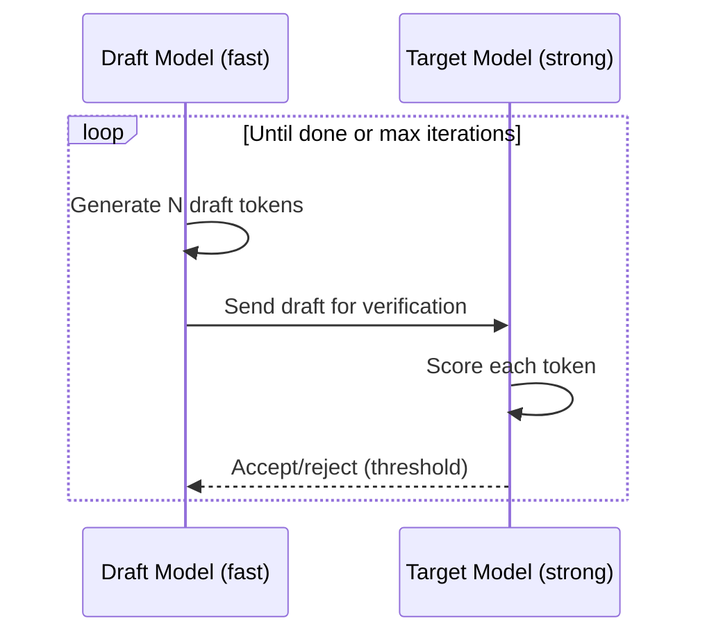

# Drafting Framework

The drafting framework implements multi-model generation strategies that trade off speed, quality, and cost. Strategies are defined in `drafting/drafting_strategies.yaml`.

Drafting is disabled by default (`AgentConfig.enable_drafting = False`).

## Strategies

### Speculative Decoding

A fast draft model generates tokens that a stronger target model verifies, accepting or rejecting each batch.

| Config | Description |
|--------|-------------|
| `draft_model` | Fast model (e.g., `gpt-3.5-turbo`, `llama3.2`) |
| `target_model` | Strong model (e.g., `gpt-4-turbo`, `claude-3.5-sonnet`) |
| `draft_tokens` | Tokens per draft batch (20–30) |
| `acceptance_threshold` | Minimum score to accept (0.7–0.8) |
| `max_iterations` | Maximum draft-verify cycles |

**Pre-configured strategies:** `fast_accurate`, `local_cloud`, `claude_fast`

### Pipeline

Multi-stage generation where each stage uses a different model with a specific role.

| Stage Role | Description |
|------------|-------------|
| `analyze` / `code` | Initial generation |
| `critique` / `review` | Critical review |
| `refine` | Incorporate feedback |
| `summarize` | Final synthesis |

Each stage has its own model, system prompt, and temperature.

**Pre-configured strategies:** `code_review` (generate → review → refine), `writing_pipeline` (outline → draft → edit → polish), `analysis_pipeline` (decompose → research → synthesize)

### Candidate Generation

Generate multiple candidates and select the best using a scoring method.

| Scoring Method | Description |
|---------------|-------------|
| `majority_vote` | Most common answer wins |
| `verifier` | Separate model scores each candidate |
| `length_preference` | Prefer longer/shorter responses |

**Pre-configured strategies:** `consensus` (multi-model vote), `best_of_n` (N candidates + verifier), `diverse_ensemble` (varied models), `self_consistency` (same model, multiple samples)

## Result Structure

`DraftResult` contains:

| Field | Type | Description |
|-------|------|-------------|
| `content` | string | Final output |
| `strategy` | string | Strategy name |
| `status` | DraftStatus | `"complete"` or `"failed"` |
| `draft_tokens` | int | Tokens drafted |
| `accepted_tokens` | int | Tokens accepted (speculative) |
| `models_used` | list[string] | All models involved |
| `stages_completed` | int | Pipeline stages run |
| `candidates_generated` | int | Candidates produced |
| `estimated_cost` | float | Estimated USD cost |
| `total_time_ms` | float | Elapsed time |

## Task Defaults

The `defaults` section in `drafting_strategies.yaml` maps task types to strategies:

| Task | Strategy |
|------|----------|
| `general` | `fast_accurate` |
| `code` | `code_review` |
| `writing` | `writing_pipeline` |
| `analysis` | `analysis_pipeline` |
| `consensus` | `consensus` |

## Related

- [Providers](providers.md) — Model providers used by drafting
- [API Models: DraftResult](../api/models.md) — Result schema
- Config file: `api/agentx_ai/drafting/drafting_strategies.yaml`
