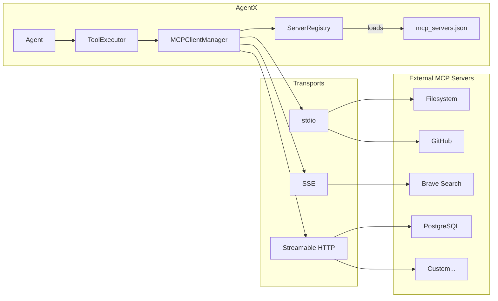
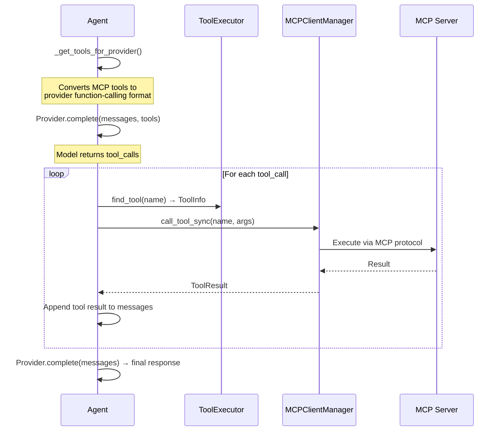

# Connectors & Tools (MCP Client)

AgentX acts as an MCP (Model Context Protocol) client, connecting to external tool servers that expose filesystem, database, search, and custom capabilities. The **Connectors & Tools** page in the client is the control center for all of it: your servers and their OAuth state, a curated connector catalog, live search of the public MCP registry, the discovered tool catalog, per-agent access, and the [skill library](../api/endpoints.md#skills).

## Connector Catalog

The fastest way to give agents real-world reach. The catalog is a curated shelf of known-good connectors — **Google Drive** (Google's official remote MCP server), GitHub, Notion, Linear, Sentry, Atlassian (Jira & Confluence), Context7, Cloudflare Docs, Hugging Face, plus local stdio classics — where "Add connector" opens the server form **prefilled** with the right URL, transport, auth mode, and a step-by-step setup note where one is needed. Nothing connects until you review and save.

Below the shelf, a search box queries the **official MCP registry** (`registry.modelcontextprotocol.io`) through the API proxy (`GET /api/mcp/registry/search`); any result maps into the same prefilled form (remote endpoints directly; npm/PyPI/OCI packages as `npx` / `uvx` / `docker run` stdio commands). Registry entries are community-published — review commands and URLs before saving.

### Google Drive setup (BYO OAuth client)

Google's Drive MCP server (`https://drivemcp.googleapis.com/mcp/v1`) requires a **pre-registered OAuth app** in your own Google Cloud project — there is no dynamic registration:

1. In the Google Cloud console, create or select a project; enable the **Google Drive API** and the **Google Drive MCP API**.
2. Configure the OAuth consent screen with the scopes `https://www.googleapis.com/auth/drive.readonly` and `https://www.googleapis.com/auth/drive.file`.
3. Create an OAuth client ID (Web application) and add the AgentX callback as an authorized redirect URI: `http://localhost:12319/api/mcp/oauth/callback` (adjust if your API runs elsewhere — `AGENTX_OAUTH_REDIRECT_URL`).
4. Set `GOOGLE_DRIVE_CLIENT_ID` / `GOOGLE_DRIVE_CLIENT_SECRET` in the API's `.env` (see `.env.example`) — the catalog quick-add references them as `${VAR}` so credentials never land in `mcp_servers.json` — or paste values directly into the dialog.

**One Google app for all your clusters.** A single OAuth client can list many authorized
redirect URIs: add each cluster's `https://<cluster-host>/api/mcp/oauth/callback`, reuse the
same client id/secret in every cluster's `.env`, set each cluster's
`AGENTX_OAUTH_REDIRECT_URL` to its own callback, and DNS routes every consent redirect back
to the right cluster. Gateway deployments already allow this: the browser redirect can't
carry the gateway token, so the gateway passes exactly `/api/mcp/oauth/callback` through
tokenless (state-validated by the API; see `clusters/template/nginx.conf.example`). Existing
clusters need the updated `nginx.conf` and a force-recreate (`agentx-manager restart` handles
the bind-mount inode). Connecting opens Google's consent page in your browser.

## Architecture



## Connection Modes

### Persistent (default for Django)

Connections stay alive across HTTP requests on a background asyncio event loop. Used by all API endpoints.

```python
manager = get_mcp_manager()
manager.connect("filesystem")         # Blocks until connected
tools = manager.list_tools()           # Available across requests
result = manager.call_tool_sync(       # Sync bridge to async MCP
    "read_file", {"path": "/tmp/test"}
)
manager.disconnect("filesystem")
```

### Scoped (context manager)

Connection lives within an `async with` block. Useful for one-off operations.

```python
async with manager.connect_server("filesystem") as conn:
    tools = conn.tools
    # connection closes when block exits
```

## Configuration

Servers are defined in `mcp_servers.json` at the project root. Create from `mcp_servers.json.example`:

```json
{
  "filesystem": {
    "transport": "stdio",
    "command": "npx",
    "args": ["-y", "@modelcontextprotocol/server-filesystem", "/home/user/projects"],
    "env": {
      "NODE_ENV": "production"
    }
  },
  "github": {
    "transport": "stdio",
    "command": "npx",
    "args": ["-y", "@modelcontextprotocol/server-github"],
    "env": {
      "GITHUB_PERSONAL_ACCESS_TOKEN": "$GITHUB_TOKEN"
    }
  },
  "brave-search": {
    "transport": "sse",
    "url": "http://localhost:8080/sse",
    "headers": {
      "Authorization": "Bearer $BRAVE_API_KEY"
    }
  }
}
```

### Environment Variable Resolution

Values prefixed with `$` in `env` and `headers` fields are resolved from the system environment at connection time. If a variable is not set, the literal string is used.

### Transport Types

| Transport | Use Case | Config Fields |
|-----------|----------|---------------|
| `stdio` | Local process servers (most common) | `command`, `args`, `env` |
| `sse` | Remote HTTP servers with SSE | `url`, `headers` |
| `streamable_http` | Remote HTTP servers | `url`, `headers` |

## Tool Execution Flow



## Tool Filtering

`AgentConfig` supports tool filtering:

| Field | Effect |
|-------|--------|
| `allowed_tools` | Only these tools are exposed to the model (whitelist) |
| `blocked_tools` | These tools are hidden from the model (blacklist) |

When both are `null`, all tools from connected servers are available.

## OAuth 2.1 (remote connectors)

Remote servers (`sse` / `streamable_http`) can carry an `auth: {"type": "oauth"}` block — AgentX handles discovery, dynamic client registration (or pre-registered `client_id`/`client_secret` for providers like Google), PKCE, and token refresh, opening your browser for consent on first connect. Tokens persist per server under `data/mcp_oauth/`.

The server card tells the truth about session state: **signed in**, **signed in (refreshes on connect)** when the access token expired but a refresh token covers it, or **session expired — sign in again on connect** when the next connect must go back through the browser (this state also triggers the new-conversation nudge). "Reset auth" forgets stored tokens for a clean sign-in.

## API Endpoints

| Endpoint | Method | Description |
|----------|--------|-------------|
| `/api/mcp/servers` | GET | List servers, connection status, and OAuth `auth_state` |
| `/api/mcp/registry/search` | GET | Search the official MCP registry (proxied, prefill-only) |
| `/api/mcp/tools` | GET | List available tools (filter: `?server=name`) |
| `/api/mcp/resources` | GET | List available resources |
| `/api/mcp/connect` | POST | Connect to server(s); OAuth consent → HTTP 202 + URL |
| `/api/mcp/disconnect` | POST | Disconnect from server(s) |
| `/api/agent/skills` | GET/POST | The skill library (see [Skills](../api/endpoints.md#skills)) |

See [API Endpoints](../api/endpoints.md#mcp-model-context-protocol) for full details.

## Related

- [Architecture Overview](../architecture/overview.md) — System context
- [API Models: MCP](../api/models.md#mcp-models) — ServerConfig, ToolInfo, ResourceInfo schemas
- Config file: `mcp_servers.json` (create from `mcp_servers.json.example`)
