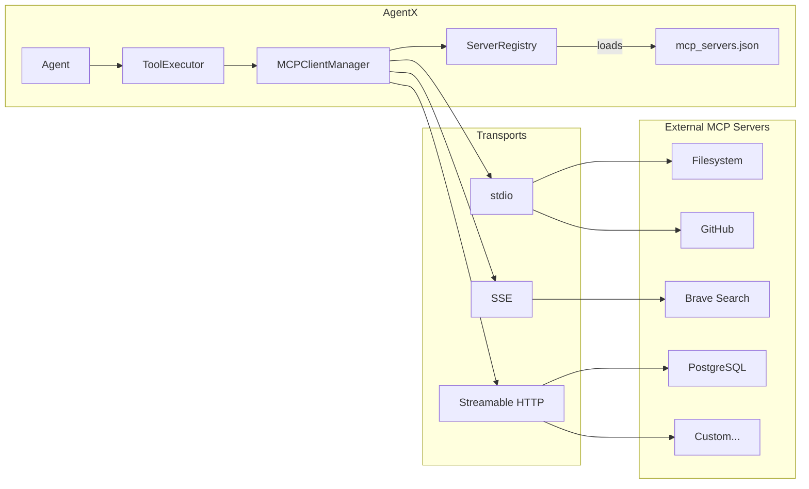
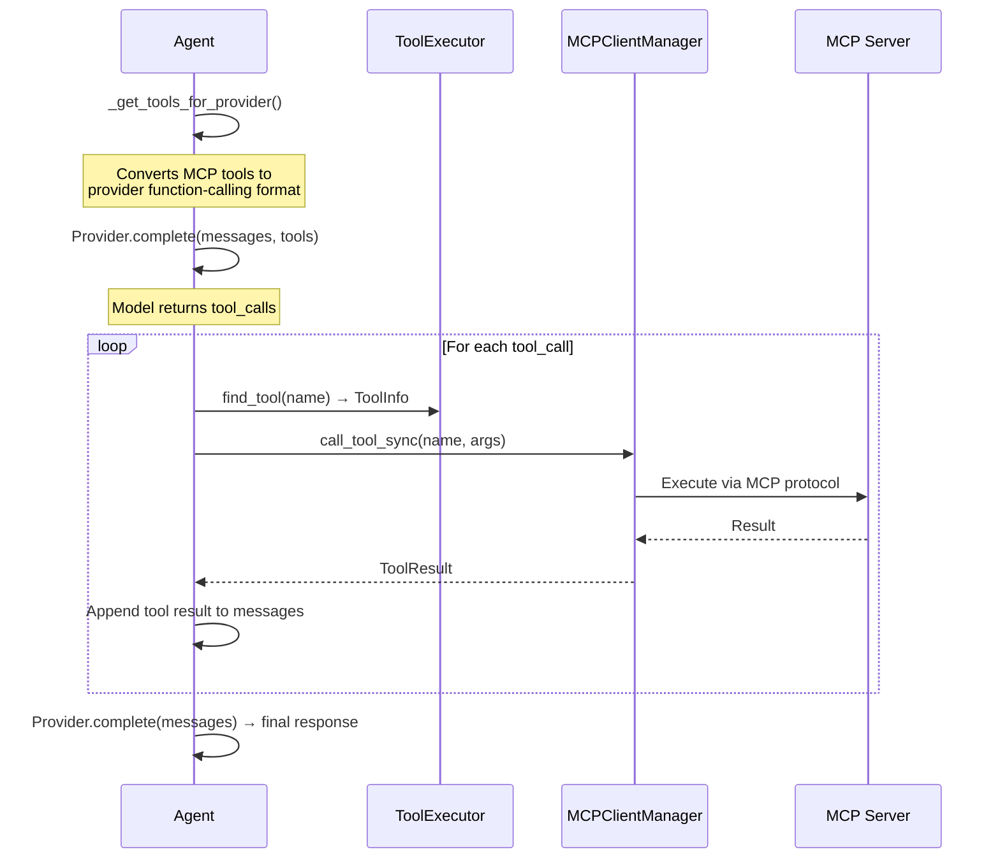

# MCP Client

AgentX acts as an MCP (Model Context Protocol) client, connecting to external tool servers that expose filesystem, database, search, and custom capabilities.

## Architecture



## Connection Modes

### Persistent (default for Django)

Connections stay alive across HTTP requests on a background asyncio event loop. Used by all API endpoints.

```python
manager = get_mcp_manager()
manager.connect("filesystem")         # Blocks until connected
tools = manager.list_tools()           # Available across requests
result = manager.call_tool_sync(       # Sync bridge to async MCP
    "read_file", {"path": "/tmp/test"}
)
manager.disconnect("filesystem")
```

### Scoped (context manager)

Connection lives within an `async with` block. Useful for one-off operations.

```python
async with manager.connect_server("filesystem") as conn:
    tools = conn.tools
    # connection closes when block exits
```

## Configuration

Servers are defined in `mcp_servers.json` at the project root. Create from `mcp_servers.json.example`:

```json
{
  "filesystem": {
    "transport": "stdio",
    "command": "npx",
    "args": ["-y", "@modelcontextprotocol/server-filesystem", "/home/user/projects"],
    "env": {
      "NODE_ENV": "production"
    }
  },
  "github": {
    "transport": "stdio",
    "command": "npx",
    "args": ["-y", "@modelcontextprotocol/server-github"],
    "env": {
      "GITHUB_PERSONAL_ACCESS_TOKEN": "$GITHUB_TOKEN"
    }
  },
  "brave-search": {
    "transport": "sse",
    "url": "http://localhost:8080/sse",
    "headers": {
      "Authorization": "Bearer $BRAVE_API_KEY"
    }
  }
}
```

### Environment Variable Resolution

Values prefixed with `$` in `env` and `headers` fields are resolved from the system environment at connection time. If a variable is not set, the literal string is used.

### Transport Types

| Transport | Use Case | Config Fields |
|-----------|----------|---------------|
| `stdio` | Local process servers (most common) | `command`, `args`, `env` |
| `sse` | Remote HTTP servers with SSE | `url`, `headers` |
| `streamable_http` | Remote HTTP servers | `url`, `headers` |

## Tool Execution Flow



## Tool Filtering

`AgentConfig` supports tool filtering:

| Field | Effect |
|-------|--------|
| `allowed_tools` | Only these tools are exposed to the model (whitelist) |
| `blocked_tools` | These tools are hidden from the model (blacklist) |

When both are `null`, all tools from connected servers are available.

## API Endpoints

| Endpoint | Method | Description |
|----------|--------|-------------|
| `/api/mcp/servers` | GET | List servers and connection status |
| `/api/mcp/tools` | GET | List available tools (filter: `?server=name`) |
| `/api/mcp/resources` | GET | List available resources |
| `/api/mcp/connect` | POST | Connect to server(s) |
| `/api/mcp/disconnect` | POST | Disconnect from server(s) |

See [API Endpoints](../api/endpoints.md#mcp-model-context-protocol) for full details.

## Related

- [Architecture Overview](../architecture/overview.md) — System context
- [API Models: MCP](../api/models.md#mcp-models) — ServerConfig, ToolInfo, ResourceInfo schemas
- Config file: `mcp_servers.json` (create from `mcp_servers.json.example`)
