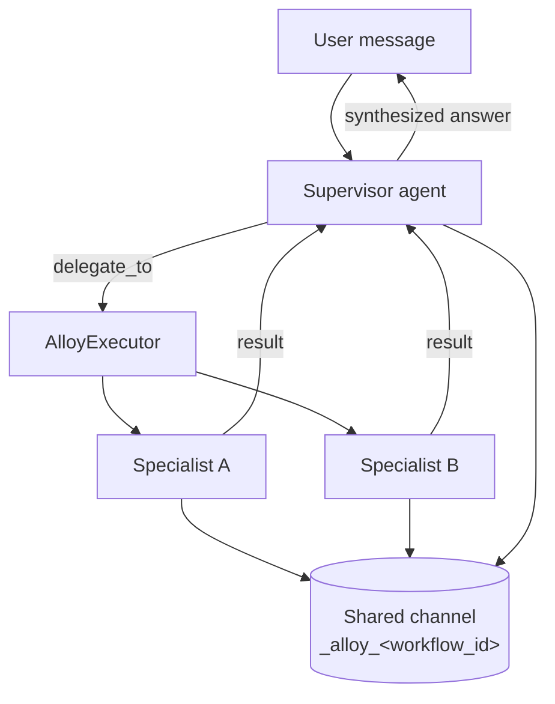

# Multi-Agent (Agent Alloy)

**Agent Alloy** is AgentX's multi-agent orchestration system (Phase 16, v1 shipped
2026-04-27). It lets one **supervisor** agent delegate focused subtasks to **specialist**
agents, coordinating their work over a shared memory channel.

A configured set of agents is called a **workflow** (an "alloy"). Workflows are opt-in: a
normal chat uses a single agent, and only becomes multi-agent when you attach a `workflow_id`.



## Data Model

A workflow binds exactly one supervisor to zero or more specialists. Members are referenced
by their immutable Docker-style `agent_id` (e.g. `bold-cosmic-falcon`), **not** by display
name — so renaming a profile never breaks a workflow.

**`Workflow`** (`api/agentx_ai/alloy/models.py`):

| Field | Type | Description |
|-------|------|-------------|
| `id` | string | Kebab-case identifier (`^[a-z0-9][a-z0-9-]*$`) |
| `name` | string | Display name |
| `description` | string? | Free-text description |
| `supervisor_agent_id` | string | `agent_id` of the supervisor profile |
| `members` | `WorkflowMember[]` | Supervisor + specialists |
| `routes` | `WorkflowRoute[]` | Declarative routing — **schema only in v1, not executed** |
| `shared_channel` | string | Workflow-scoped memory channel; auto-derived as `_alloy_{id}` when blank |
| `canvas` | object | Opaque editor state for the (future) Factory UI; no backend semantics |

**`WorkflowMember`**:

| Field | Type | Description |
|-------|------|-------------|
| `agent_id` | string | The member's immutable agent identifier |
| `role` | `"supervisor"` \| `"specialist"` | Exactly one member must be `supervisor` |
| `delegation_hint` | string? | Expertise hint shown to the supervisor in the `delegate_to` tool description |

Validation (on create/update) requires: a valid `id` pattern, exactly one supervisor, and
every `agent_id` resolving to an existing profile in `data/agent_profiles.yaml`.

## Delegation at Runtime

When a workflow is active, the supervisor gains a single extra tool, **`delegate_to`**:

```json
{
  "agent_id": "specialist-agent-id",
  "task": "A self-contained task description with all the context the specialist needs"
}
```

The `AlloyExecutor` (`alloy/executor.py`) intercepts the call, resolves the specialist's
profile, and spawns a fresh `Agent` for it. Specialists run **in isolation** — they receive
only the delegated task plus relevant memories from the shared channel, never the full
conversation history. Specialists do **not** receive the `delegate_to` tool, so they cannot
re-delegate. The specialist's full output is returned to the supervisor as a tool result,
which the supervisor then synthesizes into its reply.

All members read and write the shared channel (`_alloy_{workflow_id}`), so delegated results
and extracted facts are visible across the workflow. Each delegation also creates a child
`Goal` (Phase 15 goal tracking) linked to that channel.

### Configuration

| Key | Default | Description |
|-----|---------|-------------|
| `alloy.max_delegation_depth` | `3` | Maximum delegation nesting depth |
| `alloy.specialist_inherits_supervisor_tools` | `true` | Whether specialists get the supervisor's tool set |
| `alloy.delegation_timeout_seconds` | — | Per-delegation timeout |

## Execution & Streaming

Workflows execute through the existing streaming chat endpoint — pass a `workflow_id`:

```
POST /api/agent/chat/stream
```
```json
{
  "message": "Research and summarize the latest on X",
  "agent_profile_id": "some-profile",
  "workflow_id": "my-workflow",
  "session_id": "optional"
}
```

When `workflow_id` is set, the supervisor profile becomes the active agent, its
`memory_channel` is switched to the workflow's `shared_channel`, and the `delegate_to` tool is
added with an enum of the workflow's specialists. Without `workflow_id`, behavior is unchanged
(single-agent mode).

In addition to the standard chat SSE events, delegations emit:

| Event | Key fields |
|-------|------------|
| `delegation_start` | `delegation_id`, `target_agent_id`, `task`, `depth`, `supervisor_agent_id`, `shared_channel` |
| `delegation_chunk` | `delegation_id`, `target_agent_id`, `content` (streamed specialist tokens) |
| `delegation_tool_call` | `delegation_id`, `target_agent_id`, `tool`, `tool_call_id`, `arguments` |
| `delegation_tool_result` | `delegation_id`, `target_agent_id`, `tool`, `content`, `success`, `duration_ms` |
| `delegation_complete` | `delegation_id`, `target_agent_id`, `status`, `error`, `result_preview` |

## Storage & API

Workflows are persisted to `data/workflows.yaml` and managed by the `WorkflowManager`
singleton (mirroring `ProfileManager`). CRUD is exposed under `/api/alloy/workflows` — see
[Multi-Agent endpoints](../api/endpoints.md#multi-agent-agent-alloy).

On the client, `AlloyWorkflowContext` (`contexts/AlloyWorkflowContext.tsx`) manages the
workflow list and selection; the active workflow's id is passed to the chat stream.

## Status (v1)

Shipped: the data model + `WorkflowManager`, the `delegate_to` tool and `AlloyExecutor`,
specialist isolation, the `delegation_*` SSE events, goal-tracking integration, the workflow
CRUD API, and the client context.

Deferred (see [Roadmap → Phase 16](../roadmap.md)): the visual **Factory canvas** UI,
execution of declarative `routes` (accepted and stored but ignored), message attribution
(`agent_id` on turns), explicit agent routing / `@`-mentions, and async/parallel delegation.
