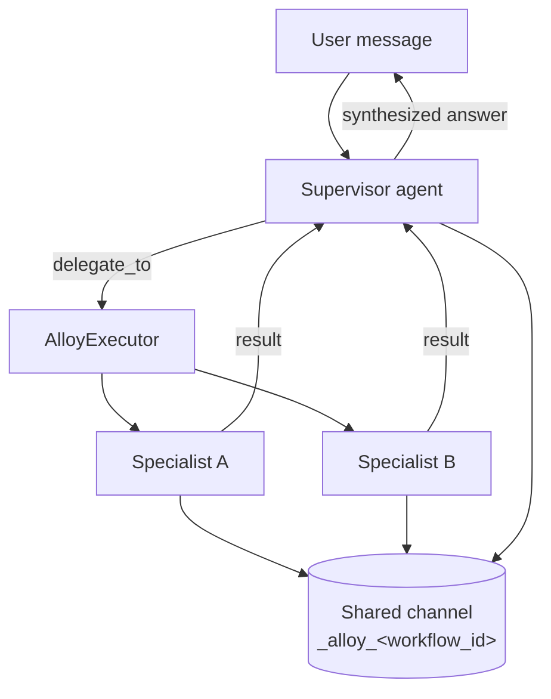

# Agent Teams (Agent Alloy)

**Agent Teams** is AgentX's multi-agent orchestration system (Phase 16, v1 shipped
2026-04-27 as *Agent Alloy* — the internal module, API routes, and config keys keep that
name; only the user-facing vocabulary changed, same precedent as Workspaces→Projects).
It lets one agent delegate focused subtasks to teammates, coordinating their work over a
shared memory channel. UI terminology: a workflow is a **Team**, the supervisor is the
**Lead**, and specialists are **Members**.

Delegation comes in two flavors:

- **Structured teams** — a saved workflow (`workflow_id` on the chat request) puts the
  team's lead in charge of the conversation with an aggressive "orchestrate, don't
  execute" supervisor prompt.
- **Ad-hoc delegation** — in ordinary chats, any agent can hand a subtask to any profile
  that **joined the team roster** (`available_for_delegation`, opt-in, off by default).
  The agent gets the `delegate_to` tool *and* a roster block in its system prompt listing
  each teammate's specialty (`delegation_hint`, falling back to the profile description)
  with deliberately soft guidance: handle it yourself by default, delegate when a
  teammate is clearly better suited. Enabled by default (`alloy.allow_adhoc_delegation`);
  nothing delegates until profiles opt onto the roster. A per-conversation **Solo/Team**
  toggle (composer chip or command palette) sends `disable_delegation` to suppress it
  for a chat — ignored under a workflow, since a team run *is* delegation.



## Data Model

A workflow binds exactly one supervisor to zero or more specialists. Members are referenced
by their immutable Docker-style `agent_id` (e.g. `bold-cosmic-falcon`), **not** by display
name — so renaming a profile never breaks a workflow.

**`Workflow`** (`api/agentx_ai/alloy/models.py`):

| Field | Type | Description |
|-------|------|-------------|
| `id` | string | Kebab-case identifier (`^[a-z0-9][a-z0-9-]*$`) |
| `name` | string | Display name |
| `description` | string? | Free-text description |
| `supervisor_agent_id` | string | `agent_id` of the supervisor profile |
| `members` | `WorkflowMember[]` | Supervisor + specialists |
| `routes` | `WorkflowRoute[]` | Declarative routing — **schema only in v1, not executed** |
| `shared_channel` | string | Workflow-scoped memory channel; auto-derived as `_alloy_{id}` when blank |
| `canvas` | object | Opaque editor state for the (future) Factory UI; no backend semantics |

**`WorkflowMember`**:

| Field | Type | Description |
|-------|------|-------------|
| `agent_id` | string | The member's immutable agent identifier |
| `role` | `"supervisor"` \| `"specialist"` | Exactly one member must be `supervisor` |
| `delegation_hint` | string? | Expertise hint shown to the supervisor in the `delegate_to` tool description |

Validation (on create/update) requires: a valid `id` pattern, exactly one supervisor, and
every `agent_id` resolving to an existing profile in `data/agent_profiles.yaml`.

## Delegation at Runtime

When a workflow is active, the supervisor gains a single extra tool, **`delegate_to`**:

```json
{
  "agent_id": "specialist-agent-id",
  "task": "A self-contained task description with all the context the specialist needs"
}
```

The `AlloyExecutor` (`alloy/executor.py`) intercepts the call, resolves the specialist's
profile, and spawns a fresh `Agent` for it. Specialists run **in isolation** — they receive
only the delegated task plus relevant memories from the shared channel, never the full
conversation history. Specialists do **not** receive the `delegate_to` tool, so they cannot
re-delegate. The specialist's full output is returned to the supervisor as a tool result,
which the supervisor then synthesizes into its reply.

All members read and write the shared channel (`_alloy_{workflow_id}`), so delegated results
and extracted facts are visible across the workflow. Each delegation also creates a child
`Goal` (Phase 15 goal tracking) linked to that channel.

### Configuration

| Key | Default | Description |
|-----|---------|-------------|
| `alloy.max_delegation_depth` | `3` | Maximum delegation nesting depth |
| `alloy.specialist_inherits_supervisor_tools` | `true` | Whether specialists get the supervisor's tool set |
| `alloy.allow_adhoc_delegation` | `true` | Allow `delegate_to` + the roster prompt in ordinary (workflow-less) chats. Safe default: the roster itself is opt-in per profile (`available_for_delegation` defaults `false`) |
| `alloy.delegation_timeout_seconds` | — | Per-delegation timeout |

## Execution & Streaming

Workflows execute through the existing streaming chat endpoint — pass a `workflow_id`:

```
POST /api/agent/chat/stream
```
```json
{
  "message": "Research and summarize the latest on X",
  "agent_profile_id": "some-profile",
  "workflow_id": "my-workflow",
  "session_id": "optional"
}
```

When `workflow_id` is set, the supervisor profile becomes the active agent, its
`memory_channel` is switched to the workflow's `shared_channel`, and the `delegate_to` tool is
added with an enum of the workflow's specialists. Without `workflow_id`, behavior is unchanged
(single-agent mode).

In addition to the standard chat SSE events, delegations emit:

| Event | Key fields |
|-------|------------|
| `delegation_start` | `delegation_id`, `target_agent_id`, `task`, `depth`, `supervisor_agent_id`, `shared_channel` |
| `delegation_chunk` | `delegation_id`, `target_agent_id`, `content` (streamed specialist tokens) |
| `delegation_tool_call` | `delegation_id`, `target_agent_id`, `tool`, `tool_call_id`, `arguments` |
| `delegation_tool_result` | `delegation_id`, `target_agent_id`, `tool`, `content`, `success`, `duration_ms` |
| `delegation_complete` | `delegation_id`, `target_agent_id`, `status`, `error`, `result_preview`, `exhibits?` (wires for exhibits produced inside the delegation, cap 5) |

Multimodal specialist output passes through: a specialist's `exhibit` and
`workspace_attached` events are forwarded **top-level, unchanged** (the image/exhibit
renders under the delegation card, and workspace auto-attach works exactly like the main
loop). The delegating agent's tool result carries an "already displayed" note so it
doesn't re-invent image URLs, and the wires are persisted as `present_exhibit` turns so
reloaded conversations rebuild the cards. Specialist internal tools run under the
specialist's own identity (usage attribution) with the conversation's user/workspace
inherited, and the specialist profile's `allowed_tools`/`blocked_tools` gating applies
inside delegations.

## Storage & API

Workflows are persisted to `data/workflows.yaml` and managed by the `WorkflowManager`
singleton (mirroring `ProfileManager`). CRUD is exposed under `/api/alloy/workflows` — see
[Multi-Agent endpoints](../api/endpoints.md#multi-agent-agent-alloy).

On the client, `AlloyWorkflowContext` (`contexts/AlloyWorkflowContext.tsx`) manages the
workflow list and selection; the active workflow's id is passed to the chat stream.

## Ambassador — the parallel relay

An **ambassador** is a normal agent profile (`kind: 'ambassador'`) that runs *parallel* to a
conversation and briefs you on it — **without ever entering or polluting the main transcript**.
That no-pollution invariant is load-bearing: the ambassador writes only to a Redis **sidecar**
(the `amb_thread:` family), never `conversation_logs` / `conv_summary:`, and its tool belt is
**SELECT-only**.

- **What it does** — you ask it about the conversation ("what did my agents decide?",
  "summarize this", "explore that turn") and it answers from a curated read-only tool belt
  (`summarize_conversation` · `explore_conversation` · `read_conversation` · `list_conversations`)
  over a bounded agentic loop. It briefs *to you* (second person, names the agent) and never
  speaks into the transcript as itself.
- **Two-way voice** — spoken briefings (TTS via a provider's `/audio/speech`) and hold-to-talk
  questions (STT via `/audio/transcriptions`); a transcript routes through the same answer core,
  so voice gets the same tools and continuity as text.
- **Outbound relay** — it can *draft* a message you review and send into the conversation as a
  real **user** turn (ghostwriter, not speaker) — so the invariant still holds.
- **One thread** — briefings and Q&A are one ordered "Inquiry" thread; the panel docks beside the
  chat (non-modal), so you can watch the agent work and talk to the ambassador at once.

Configure it in **Settings → Ambassador** (the default ambassador profile) and per-profile (the
`ambassador` block: personas, speech/voice model, verbosity). **Ambassador v2** — a fully
conversational, tool-using relay with a standalone command-deck thread — is in progress.

## Status

Shipped (v1 plus the routing/delegation waves through v0.21.5):

- Data model + `WorkflowManager`, the `delegate_to` tool, `AlloyExecutor`, and specialist isolation
- Live `delegation_*` SSE streaming, goal-tracking integration, the workflow CRUD API, and the client context
- **Parallel / fan-out delegation** with a client trace/replay modal (per-delegation tokens, cost, and wall-clock)
- **Per-turn attribution** — `agent_id` on turns and `conversation_logs`, restored to display names on reload
- **Explicit routing** — `target_agent_id` on the chat-stream request (priority `workflow_id > target_agent_id > agent_profile_id > default`)
- **Per-agent tool isolation** — `allowed_tools` / `blocked_tools` enforced per profile
- **Ad-hoc agent-to-agent delegation** — `delegate_to` in workflow-less chats, gated by `alloy.allow_adhoc_delegation` (depth-limited, no self-delegation)
- **First-class conversational delegation** — a `delegation_roster` system-prompt block (teammates + specialties from the opt-in roster, same source as the tool enum), per-profile `delegation_hint`, opt-in `available_for_delegation` (default off), the global gate default-ON, and a per-conversation Solo/Team toggle (`disable_delegation`)
- **@-mention routing** — an inline `@agent-id` / `@name` routes a turn; `AgentParticipant` graph nodes + a client `@`-autocomplete composer

Deferred (see [Roadmap → Phase 16](../roadmap.md)): the visual **Factory canvas** editor,
execution of declarative `routes` (accepted and stored but ignored), async (background)
delegation, and per-workflow tool subsetting.
