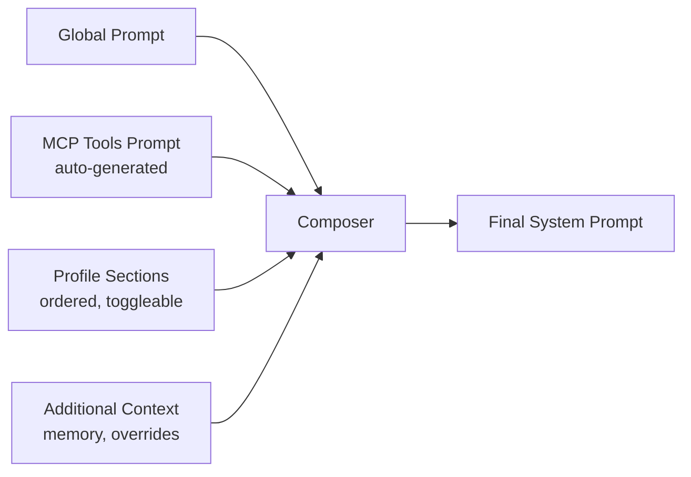

# Prompt System

The prompt system manages system prompt composition through profiles, sections, and a global prompt. All components combine to produce the final system prompt sent to the model.

## Composition Pipeline



**Composition order:**
1. **Global prompt** — Core persona and behavior (applied to all interactions)
2. **MCP tools prompt** — Auto-generated description of available tools
3. **Profile sections** — Enabled sections sorted by `order`
4. **Additional context** — Memory context, request-specific overrides

If `system_override` is set in the request, it replaces the entire composed prompt.

## Profiles

A profile is a named collection of sections representing a use case (e.g., "Developer", "Creative Writer").

```yaml
# system_prompts.yaml
profiles:
  - id: default
    name: Default Assistant
    description: General-purpose AI assistant
    is_default: true
    sections:
      - id: identity
        name: Identity
        type: persona
        content: "You are a helpful AI assistant."
        enabled: true
        order: 0
      - id: guidelines
        name: Guidelines
        type: constraints
        content: "Be concise. Cite sources when possible."
        enabled: true
        order: 1
```

Profiles are selected via the `profile_id` parameter in chat endpoints. The default profile is used when none is specified.

## Section Types

| Type | Purpose |
|------|---------|
| `persona` | Identity and personality definition |
| `task` | Task-specific instructions |
| `format` | Output format requirements |
| `constraints` | Behavioral constraints and rules |
| `examples` | Few-shot examples |
| `context` | Background information |
| `custom` | Anything else |

Sections can be individually enabled/disabled and reordered within a profile.

## Global Prompt

The global prompt applies to all interactions regardless of profile. It defines the core persona that persists across profile switches.

```python
manager = get_prompt_manager()
manager.set_global_prompt("Always be helpful and concise.", enabled=True)
```

## MCP Tools Prompt

When MCP servers are connected, the system auto-generates a tools description that gets injected into the system prompt. This tells the model what tools are available and how to use them.

Generated by `generate_mcp_tools_prompt()` from the list of connected tools.

## Storage

Prompts are stored in `data/system_prompts.yaml`. The `PromptManager` singleton:
- Initializes with defaults from `prompts/defaults.py`
- Loads custom configuration from YAML on startup
- Saves changes back to YAML on profile/global prompt updates

## API Endpoints

| Endpoint | Method | Description |
|----------|--------|-------------|
| `/api/prompts/profiles` | GET | List all profiles |
| `/api/prompts/profiles/{id}` | GET | Profile detail + composed preview |
| `/api/prompts/global` | GET | Get global prompt |
| `/api/prompts/global/update` | POST | Update global prompt |
| `/api/prompts/sections` | GET | List all sections |
| `/api/prompts/compose` | GET | Preview composed prompt |
| `/api/prompts/mcp-tools` | GET | Get auto-generated tools prompt |

See [API Endpoints](../api/endpoints.md#prompts) for full details.

## Related

- [API Models: Prompt](../api/models.md#prompt-models) — PromptProfile, PromptSection, GlobalPrompt schemas
- [Chat](chat.md) — How prompts integrate with chat requests
- Config file: `data/system_prompts.yaml`
