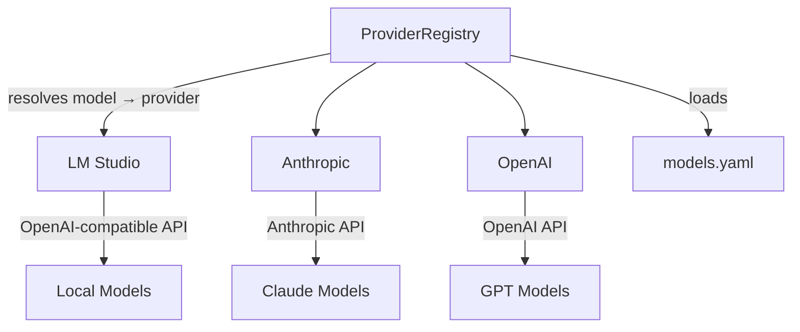

# Model Providers

The provider system provides a unified interface for interacting with different LLM backends. All providers implement the `ModelProvider` abstract class.

## Provider Registry



`ProviderRegistry` is a lazy singleton that:
- Loads model definitions from `providers/models.yaml`
- Resolves model names to their provider (e.g., `"claude-3-5-sonnet-latest"` → Anthropic)
- Creates provider instances on demand with config from env vars or `data/config.json`

```python
registry = get_registry()
provider, model_id = registry.get_provider_for_model("claude-3-5-sonnet-latest")
result = await provider.complete(messages, model_id)
```

## Implementations

| Provider | Class | API | Config |
|----------|-------|-----|--------|
| LM Studio | `LMStudioProvider` | OpenAI-compatible (local) | `LMSTUDIO_BASE_URL` (default: `http://localhost:1234/v1`) |
| Anthropic | `AnthropicProvider` | Anthropic API | `ANTHROPIC_API_KEY` |
| OpenAI | `OpenAIProvider` | OpenAI API | `OPENAI_API_KEY` |

All providers support the same interface:

| Method | Description |
|--------|-------------|
| `complete(messages, model, **kwargs)` | Full completion (async) |
| `stream(messages, model, **kwargs)` | Streaming completion → `AsyncIterator[StreamChunk]` |
| `get_capabilities(model)` | Returns `ModelCapabilities` for a model |
| `list_models()` | Returns available model names |
| `health_check()` | Tests connectivity |

### Common Parameters

| Parameter | Type | Default | Description |
|-----------|------|---------|-------------|
| `temperature` | float | `0.7` | Sampling temperature |
| `max_tokens` | int | `null` | Maximum output tokens |
| `tools` | list[dict] | `null` | Function calling tools |
| `tool_choice` | string/dict | `null` | Tool selection (`"auto"`, `"none"`, or specific) |
| `stop` | list[string] | `null` | Stop sequences |

## Model Configuration

Models are defined in `providers/models.yaml`:

```yaml
models:
  claude-3-5-sonnet-latest:
    provider: anthropic
    context_window: 200000
    supports_tools: true
    supports_vision: true
    cost_per_1k_input: 0.003
    cost_per_1k_output: 0.015

  llama3.2:
    provider: lmstudio
    context_window: 8192
    supports_tools: true
    supports_streaming: true

defaults:
  chat: null           # Uses DEFAULT_MODEL env var
  reasoning: null      # Falls back to chat default
  extraction: null     # Falls back to chat default
```

The registry also discovers models dynamically from LM Studio's `/v1/models` endpoint.

## Environment Variables

| Variable | Description |
|----------|-------------|
| `DEFAULT_MODEL` | Default model for chat (default: `"llama3.2"`) |
| `LMSTUDIO_BASE_URL` | LM Studio API URL |
| `ANTHROPIC_API_KEY` | Anthropic API key |
| `OPENAI_API_KEY` | OpenAI API key |
| `DEBUG_LOG_LLM_REQUESTS` | Log full request payloads when set to `1`/`true` |

Provider settings can also be set at runtime via `POST /api/config/update`.

## API Endpoints

| Endpoint | Method | Description |
|----------|--------|-------------|
| `/api/providers` | GET | List configured providers |
| `/api/providers/models` | GET | List models with capabilities |
| `/api/providers/health` | GET | Health check all providers |

See [API Endpoints](../api/endpoints.md#providers) for full details.

## Related

- [API Models: Provider](../api/models.md#provider-models) — Message, CompletionResult, ModelCapabilities schemas
- Config file: `api/agentx_ai/providers/models.yaml`
