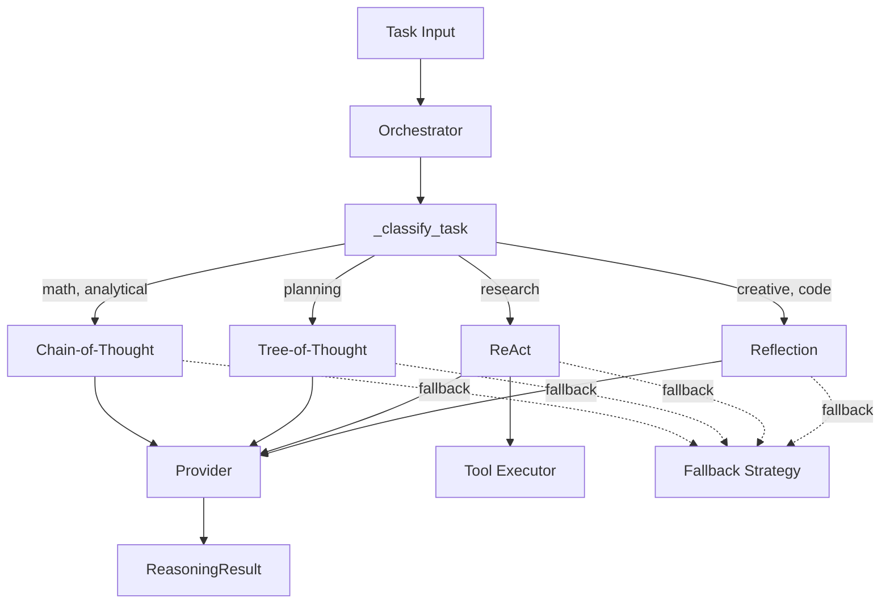

# Reasoning Framework

The reasoning framework provides structured thinking strategies for complex tasks. An orchestrator classifies tasks and selects the appropriate strategy automatically.

## Architecture



## Strategies

| Strategy | Class | Use Case | How It Works |
|----------|-------|----------|--------------|
| Chain-of-Thought | `ChainOfThought` | Math, analytical, simple | Step-by-step reasoning with explicit intermediate steps |
| Tree-of-Thought | `TreeOfThought` | Planning, design | Explores multiple solution branches (BFS/DFS/beam search) |
| ReAct | `ReActAgent` | Research, tool-heavy tasks | Interleaves reasoning with tool actions (Reason-Act-Observe loop) |
| Reflection | `ReflectiveReasoner` | Creative, code | Generates, self-critiques, and revises through multiple rounds |

## Task Classification

The orchestrator classifies tasks by keyword matching in `_classify_task()`:

| Task Type | Keywords | Default Strategy |
|-----------|----------|-----------------|
| `math` | calculate, compute, solve, equation, formula | CoT |
| `code` | code, program, function, implement, debug | Reflection |
| `research` | search, find information, look up, research | ReAct |
| `planning` | plan, design, strategy, organize, roadmap | ToT |
| `creative` | write, create, compose, draft, story, poem | Reflection |
| `analytical` | analyze, compare, evaluate, assess, review | CoT |
| `simple` | what is, who is, when did, define, list | CoT |
| `unknown` | (no match) | CoT (fallback) |

## Strategy Configs

### Chain-of-Thought (`CoTConfig`)

| Field | Default | Description |
|-------|---------|-------------|
| `model` | `"llama3.2"` | Model to use |
| `mode` | `"zero_shot"` | `"zero_shot"` or `"few_shot"` |
| `examples` | `[]` | Few-shot examples (if `few_shot` mode) |
| `max_steps` | `10` | Maximum reasoning steps |

### Tree-of-Thought (`ToTConfig`)

| Field | Default | Description |
|-------|---------|-------------|
| `model` | `"llama3.2"` | Model to use |
| `branching_factor` | `3` | Branches per node |
| `max_depth` | `3` | Maximum tree depth |
| `search_strategy` | `"bfs"` | `"bfs"`, `"dfs"`, or `"beam"` |
| `beam_width` | `2` | Beam width (if beam search) |

### ReAct (`ReActConfig`)

| Field | Default | Description |
|-------|---------|-------------|
| `model` | `"llama3.2"` | Model to use |
| `tools` | `[]` | Available `Tool` objects |
| `max_iterations` | `10` | Max reason-act-observe cycles |

### Reflection (`ReflectionConfig`)

| Field | Default | Description |
|-------|---------|-------------|
| `model` | `"llama3.2"` | Model to use |
| `max_revisions` | `3` | Maximum self-revision rounds |
| `critique_model` | `null` | Optional separate model for critique |

## Result Structure

`ReasoningResult` contains:

| Field | Type | Description |
|-------|------|-------------|
| `answer` | string | Final response |
| `strategy` | string | Strategy used |
| `status` | ReasoningStatus | `"complete"` or `"failed"` |
| `steps` | list[ThoughtStep] | Full reasoning trace |
| `total_steps` | int | Step count |
| `branches_explored` | int | ToT branches explored |
| `actions_taken` | int | ReAct actions executed |
| `revisions` | int | Reflection revision count |
| `total_tokens` | int | Token usage |
| `total_time_ms` | float | Elapsed time |

## Orchestrator Config

```python
from agentx_ai.reasoning.orchestrator import ReasoningOrchestrator, OrchestratorConfig

config = OrchestratorConfig(
    default_model="llama3.2",
    fallback_strategy="cot",    # Fallback if primary fails
    enable_fallback=True,
)

orchestrator = ReasoningOrchestrator(config)
result = await orchestrator.reason("Plan a week-long trip to Japan")
# result.strategy == "tot" (auto-classified as planning)
```

The strategy map can be overridden in `OrchestratorConfig.strategy_map` to change which strategy handles each task type.

## Integration

The Agent uses reasoning through `Agent.run()`:

1. Agent receives a task
2. `TaskPlanner` decomposes into subtasks
3. For each subtask, `ReasoningOrchestrator.reason()` is called
4. Results are aggregated into the final `AgentResult`

In chat mode (`Agent.chat(simple_mode=True)`), reasoning is bypassed — the agent uses direct provider completion instead.

## Related

- [Agent Core](../architecture/overview.md) — How reasoning fits into the agent pipeline
- [API: Agent Run](../api/endpoints.md#run-task) — Endpoint with `reasoning_strategy` parameter
- [API Models: ReasoningResult](../api/models.md#agent-models) — Result schema
