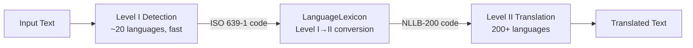

# Translation System

Two-level language detection and translation system supporting 200+ languages via NLLB-200.

## Architecture



## Two-Level Design

### Level I: Language Detection

Fast detection across ~20 common languages using `eleldar/language-detection`.

Returns an ISO 639-1 code (e.g., `fr`, `de`, `ja`) with a confidence score.

**Supported languages:** Arabic, Bulgarian, German, Greek, English, Spanish, French, Hindi, Italian, Japanese, Dutch, Polish, Portuguese, Russian, Swahili, Thai, Turkish, Urdu, Vietnamese, Chinese.

### Level II: Translation

Comprehensive translation across 200+ languages using `facebook/nllb-200-distilled-600M`.

Uses NLLB-200 language codes in `{language}_{script}` format (e.g., `fra_Latn`, `deu_Latn`, `jpn_Jpan`).

## Key Classes

### TranslationKit

Manages model loading and provides detection/translation methods.

| Method | Description |
|--------|-------------|
| `detect_language_level_i(text)` | Detect language → `{language, confidence}` |
| `translate_text(text, target_language)` | Translate to target NLLB-200 code |

Models load eagerly at initialization (~600 MB download on first run from HuggingFace). The `TranslationKit` is wrapped in a `@lazy_singleton` so models only load on the first translation request, not at server startup.

### LanguageLexicon

Bridges ISO 639 Level I detection codes to Level II translation codes.

| Method | Description |
|--------|-------------|
| `convert_level_i_detection_to_level_ii(code)` | Convert `"fr"` → `"fra_Latn"` |

Uses the `iso639` library for terminological code lookup, then maps to the NLLB-200 code list.

## Language Codes

Translation uses NLLB-200 codes in `{iso639-3}_{script}` format:

| Language | NLLB-200 Code |
|----------|---------------|
| English | `eng_Latn` |
| French | `fra_Latn` |
| German | `deu_Latn` |
| Spanish | `spa_Latn` |
| Chinese (Simplified) | `zho_Hans` |
| Japanese | `jpn_Jpan` |
| Arabic | `arb_Arab` |
| Hindi | `hin_Deva` |
| Russian | `rus_Cyrl` |
| Korean | `kor_Hang` |

The full list of 200+ supported codes is in `kit/translation.py` (`nlb200_list`).

## API Usage

### Detect Language

```bash
curl -X POST http://localhost:12319/api/tools/language-detect-20 \
  -H "Content-Type: application/json" \
  -d '{"text": "Bonjour, comment allez-vous?"}'
```

**Response:**
```json
{
  "original": "Bonjour, comment allez-vous?",
  "detected_language": "fr",
  "confidence": 98.5
}
```

### Translate Text

```bash
curl -X POST http://localhost:12319/api/tools/translate \
  -H "Content-Type: application/json" \
  -d '{"text": "Hello, world!", "targetLanguage": "fra_Latn"}'
```

**Response:**
```json
{
  "original": "Hello, world!",
  "translatedText": "Bonjour, monde!",
  "targetLanguage": "fra_Latn"
}
```

## Models

| Purpose | Model | Size |
|---------|-------|------|
| Language detection | `eleldar/language-detection` | ~50 MB |
| Translation | `facebook/nllb-200-distilled-600M` | ~600 MB |

Models are downloaded from HuggingFace on first use. Pre-download with `task models:download`.

## Related

- [API Endpoints: Translation](../api/endpoints.md#translation) — Full endpoint reference
- Source: `api/agentx_ai/kit/translation.py`
