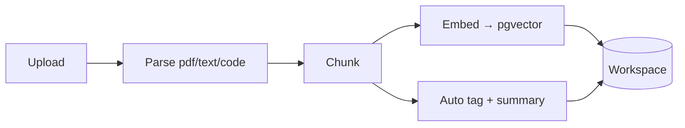

# Workspaces, Document RAG & Agent Shells

**Workspaces** let you hand an agent *files* — not just its learned memory and the web. A
workspace is a named, persistent container of documents with a searchable manifest; attach
one to a conversation and the agent can search it, cite it, and (opt-in) run commands
against it. (Shipped v0.21.103–112.)

Open it from the command palette → **"Open Workspaces"**.

## Document RAG

Upload PDFs, text, markdown, or code into a workspace (drag onto the drop-zone or click to
browse). Each file is processed in the background:



A document moves `pending → ready` (or `failed`), with live status in the drawer. Storage is
split three ways: file **bytes** in a content-addressed blob store (dedup by sha256),
**manifest** rows in Postgres, **chunk vectors** in pgvector.

**Attach a workspace to a conversation** (from the drawer) and the agent:

- sees the workspace's **file manifest** every turn (names + tags + summaries) — so it knows
  *what corpus it has* before searching;
- retrieves in two tiers — **`workspace_search`** (catalog: by filename/tag/summary) to find
  the right *file*, then **`document_query`** (semantic: pgvector) to find the right *passage*,
  and **`read_document`** for full text;
- **cites** the documents it used (they show in the conversation's Sources panel).

Per-file and per-workspace size quotas are enforced at upload.

## Agent Shells (opt-in)

Turn on **"Allow shell"** for a workspace and agents attached to it get sandboxed shell
tools — `run_command` plus `write_file` / `read_file` / `list_files` — operating on a working
copy of the workspace's files. It's **off by default**: this is real command execution, so it's
a deliberate opt-in, per workspace.

Each workspace picks a **backend**:

| Backend | Isolation | Network | Installs | Needs |
|---|---|---|---|---|
| **Bubblewrap** (default) | filesystem jailed to the work dir, scrubbed env, non-root, time-limited | **off** | no | `bubblewrap` on the server |
| **Container** | a persistent per-workspace Docker container, clean (no host secrets), on its own bridge | **on** | yes (`pip`/`apt`/`npm`) | `shell.docker.enabled` + a Docker daemon |

Both keep the agent away from your secrets and the host: Bubblewrap can't read `data/` or
reach the network; the Container shares none of the host filesystem, so network + root *inside*
it are safe — there's nothing to exfiltrate but the workspace's own files.

**Container lifecycle** is visible and controllable in the drawer: live memory / CPU / install
size, an idle-GC countdown, and **Start / Stop / Reset** (drop installs, keep files) / **Remove**.
Installed packages persist across commands and conversations until you reset or delete the
workspace.

### Deploying the container backend

The API drives Docker as a *client*. In development the API runs on the host and uses the host
Docker directly. In production (the API runs in a container) enable the **Docker-in-Docker
sidecar** overlay — the API talks to the sidecar's own daemon over authenticated TLS on the
internal network; the host's Docker socket is never mounted:

```bash
docker compose -f docker-compose.yml -f docker-compose.shell.yml --profile production up -d
# and set shell.docker.enabled = true
```

The sidecar is per-stack, so enable it only on clusters that need install-capable shells —
everywhere else the lightweight Bubblewrap backend stays free.

## Configuration

- `shell.*` — sandbox limits shared by both backends: `timeout_seconds`, `max_output_chars`,
  `deny_patterns`, `allow_network` (bubblewrap), `max_materialize_bytes`, `workdir_cleanup_days`.
- `shell.docker.*` — container backend: `enabled`, `image` (default `python:3.12-slim`),
  `memory`, `cpus`, `pids_limit`, `network`, `idle_ttl_days`.

See the [API reference](/docs/api/endpoints#workspaces) for the workspace + shell-container endpoints.
