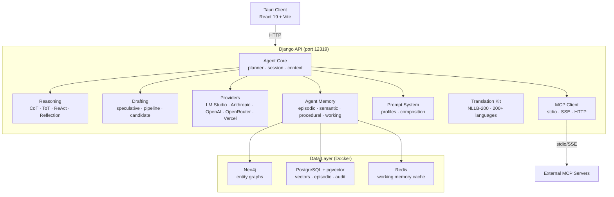

# AgentX Documentation

AgentX is a self-hosted, **glassbox** AI agent platform: persistent multi-type memory, multi-agent **Agent Alloy** orchestration, four reasoning strategies, MCP tools, and your choice of model — all behind a Django REST API you run yourself, with every step of the agent loop observable.

> **Current release:** v0.21.108 (the v0.20 milestone — "Mobile-Ready Alpha").

## Architecture at a Glance

## Key Features

| Feature         | Description                                                         | Docs                                   |
| --------------- | ------------------------------------------------------------------- | -------------------------------------- |
| **Agent Chat**  | Conversational AI with streaming, tool use, and session management  | [Chat](features/chat.md)               |
| **Reasoning**   | 4 strategies (CoT, ToT, ReAct, Reflection) with auto-selection      | [Reasoning](features/reasoning.md)     |
| **Drafting**    | Speculative decoding, multi-stage pipelines, N-best candidates      | [Drafting](features/drafting.md)       |
| **MCP Client**  | Connect to external tool servers via stdio, SSE, or HTTP            | [MCP](features/mcp.md)                 |
| **Multi-Agent** | Agent Alloy — supervisor delegates subtasks to specialist agents    | [Multi-Agent](features/multi-agent.md) |
| **Providers**   | Unified interface for LM Studio, Anthropic, OpenAI, OpenRouter, Vercel | [Providers](features/providers.md)     |
| **Prompts**     | Profile-based prompt composition with global prompt layer           | [Prompts](features/prompts.md)         |
| **Memory**      | 4-type persistent memory with recall, extraction, and consolidation | [Memory](features/memory.md)           |
| **Translation** | Two-level detection + NLLB-200 translation for 200+ languages       | [Translation](features/translation.md) |

## Quick Links

|                                                                                                |                                                                              |
| ---------------------------------------------------------------------------------------------- | ---------------------------------------------------------------------------- |
| **[Quick Start](getting-started/quickstart.md)** — Install and run AgentX in minutes           | **[API Reference](api/endpoints.md)** — All REST API endpoints with examples |
| **[Architecture](architecture/overview.md)** — System design, module layout, request lifecycle | **[Development](development/setup.md)** — Setup, contributing, and testing   |
| **[Database Stack](architecture/databases.md)** — Neo4j, PostgreSQL + pgvector, Redis          | **[Roadmap](roadmap.md)** — Development history and future plans             |

## Technology Stack

| Layer           | Technology               | Purpose                                   |
| --------------- | ------------------------ | ----------------------------------------- |
| **Frontend**    | Tauri v2 + React 19      | Desktop application shell                 |
| **Build**       | Vite + TypeScript        | Fast development and bundling             |
| **Backend**     | Django 5.2               | REST API framework                        |
| **AI/ML**       | HuggingFace Transformers · sentence-transformers | Translation (NLLB-200) + local embeddings |
| **Graph DB**    | Neo4j 5.15               | Entity relationships and knowledge graphs |
| **Vector DB**   | PostgreSQL + pgvector    | Semantic search and episodic memory       |
| **Cache**       | Redis 7                  | Working memory and session state          |
| **Task Runner** | Task (Taskfile)          | Development automation                    |
| **Python**      | uv                       | Fast dependency management                |
| **Client**      | bun                      | Client package management                 |

## Project Status

**Completed (Phases 1-14, 17):**

- Django API with 70+ REST endpoints (chat, agent, memory, MCP, providers, prompts, profiles, jobs, auth, multi-agent, config)
- Tauri desktop app: multi-page layout, browser-style conversation tabs, drawer panels, agent profiles
- Mobile-ready: Tauri v2 Android target (v0.20.0 — "Mobile-Ready Alpha")
- Two-level translation system (200+ languages)
- Database stack (Neo4j, PostgreSQL + pgvector, Redis)
- MCP client with stdio/SSE/HTTP transports
- Model provider abstraction (LM Studio, Anthropic, OpenAI, OpenRouter, Vercel AI Gateway)
- Drafting framework (speculative, pipeline, candidate)
- Reasoning framework (CoT, ToT, ReAct, Reflection)
- Agent core with task planning and goal tracking
- Memory system: 4 types, recall layer (5 techniques), extraction pipeline, consolidation
- Context gating: task-aware compression, intent-based retrieval, trajectory compression
- Agent identity: Docker-style IDs, self-memory channels, assistant self-extraction
- Three-layer fact verification pipeline (hash → semantic → LLM adjudication)
- Server management (Phase 17): optional session auth, Docker production stack, multi-cluster deploy, client/API version matching
- 190+ backend tests

**In Progress:**

- Phase 15: Plan execution (Core Complete — executor, Redis-tracked state, streamed progress, cancellation)
- Phase 16: Multi-agent — Agent Alloy v1 + routing, ad-hoc delegation, and @-mention routing shipped (~65%)
- Phase 18: UX improvements + memory tuning (~93%)

See the [Roadmap](roadmap.md) for detailed phase history.

## License

This project is licensed under the [MIT License](https://github.com/QR-Madness/agentx/blob/main/LICENSE).
