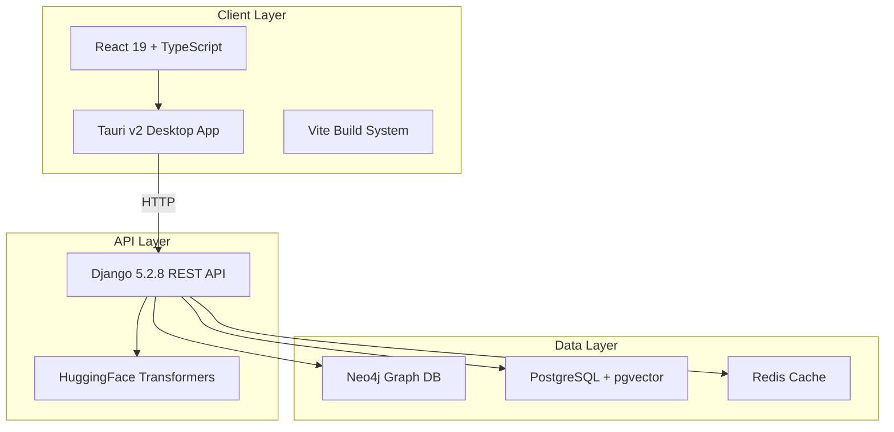

# Architecture Overview

AgentX follows a two-tier architecture with clear separation between API and client layers.

## System Architecture

## Core Components

- **Client Layer**: Desktop application built with Tauri and React
- **API Layer**: Django REST API providing AI services
- **Data Layer**: Multi-database stack for different use cases

See [API Layer](api.md), [Client Layer](client.md), and [Database Stack](databases.md) for details.
