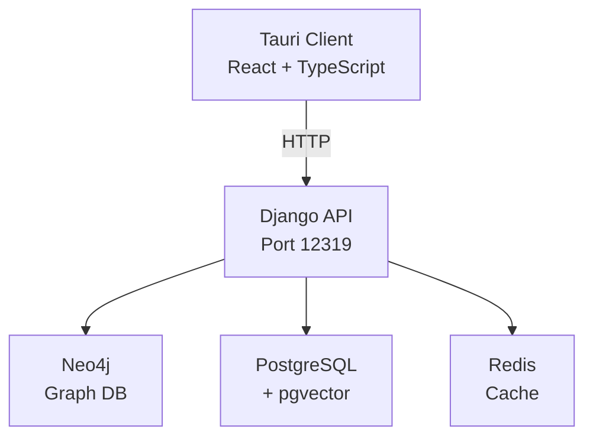

# AgentX Documentation

Welcome to the AgentX documentation. AgentX is an AI Agent Platform combining MCP client integration, drafting models, reasoning frameworks, and a sophisticated memory system.

## Overview

AgentX is built on a modern, two-tier architecture:

- **Backend**: Django REST API providing AI-powered services
- **Frontend**: Tauri desktop application with React/TypeScript
- **AI Features**: Multi-level translation, MCP client, drafting models, reasoning framework
- **Memory Stack**: Neo4j graph database, PostgreSQL with pgvector, and Redis

## Key Features

### Translation System
Multi-level language detection and translation supporting 200+ languages:

- Fast initial detection (~20 languages)
- Comprehensive translation using NLLB-200 architecture
- Confidence scoring and fallback mechanisms

### Memory System
Hybrid memory architecture combining:

- **Neo4j**: Graph-based relationship analysis
- **PostgreSQL + pgvector**: Vector embeddings for semantic search
- **Redis**: Fast in-memory caching

### Desktop Application
Native desktop experience with:

- Tab-based interface (Dashboard, Translation, Chat, Tools)
- Cross-platform support via Tauri v2
- Fast development with Vite + React 19

## Quick Links

-   :material-rocket-launch:{ .lg .middle } **Getting Started**

    ---

    Install and run AgentX in minutes

    [:octicons-arrow-right-24: Installation](getting-started/installation.md)

-   :material-code-braces:{ .lg .middle } **Development**

    ---

    Set up your development environment

    [:octicons-arrow-right-24: Setup Guide](development/setup.md)

-   :material-api:{ .lg .middle } **API Reference**

    ---

    Explore the REST API endpoints

    [:octicons-arrow-right-24: API Docs](api/endpoints.md)

-   :material-database:{ .lg .middle } **Database Stack**

    ---

    Learn about the database architecture

    [:octicons-arrow-right-24: Databases](architecture/databases.md)

-   :material-road-variant:{ .lg .middle } **Roadmap**

    ---

    Development history and future plans

    [:octicons-arrow-right-24: Roadmap](roadmap.md)

## Architecture at a Glance

## Technology Stack

| Layer | Technology | Purpose |
|-------|-----------|---------|
| **Frontend** | Tauri v2 + React 19 | Desktop application shell |
| **Build** | Vite + TypeScript | Fast development & bundling |
| **Backend** | Django 5.2.8 | REST API framework |
| **AI/ML** | HuggingFace Transformers | Language models |
| **Graph DB** | Neo4j 5.15 | Relationship analysis |
| **Vector DB** | PostgreSQL + pgvector | Semantic search |
| **Cache** | Redis 7 | In-memory data store |
| **Task Runner** | Task (Taskfile) | Development automation |
| **Package Manager** | uv | Fast Python dependency management |

## Project Status

AgentX is under active development. See the [Development Roadmap](roadmap.md) for detailed progress.

**Completed (Phases 1-10):**
- Django API with translation endpoints
- Tauri desktop application with cosmic theme
- Two-level translation system (200+ languages)
- Database stack (Neo4j, Postgres, Redis)
- MCP client integration
- Model provider abstraction (OpenAI, Anthropic, Ollama)
- Drafting framework (speculative, pipeline, candidates)
- Reasoning framework (CoT, ToT, ReAct, Reflection)
- Agent core with task planning
- Core test suite (50 tests)

**In Progress:**
- Phase 11: Memory System (90%)
- Phase 13: UI Implementation (15%)

## License

This project is licensed under the [MIT License](https://github.com/QR-Madness/agentx/blob/main/LICENSE).
