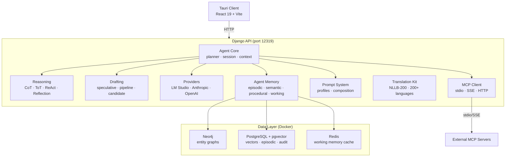

# AgentX Documentation

AgentX is an AI Agent Platform combining MCP client integration, multi-model reasoning, drafting strategies, and a persistent memory system — all backed by a Django REST API.

## Architecture at a Glance

```mermaid
graph TB
    Client[Tauri Client<br/>React 19 + Vite]

    subgraph API["Django API (port 12319)"]
        Agent[Agent Core<br/>planner · session · context]
        Reasoning[Reasoning<br/>CoT · ToT · ReAct · Reflection]
        Drafting[Drafting<br/>speculative · pipeline · candidate]
        Providers[Providers<br/>LM Studio · Anthropic · OpenAI]
        MCP[MCP Client<br/>stdio · SSE · HTTP]
        Prompts[Prompt System<br/>profiles · composition]
        Translation[Translation Kit<br/>NLLB-200 · 200+ languages]
        Memory[Agent Memory<br/>episodic · semantic · procedural · working]
    end

    subgraph Data["Data Layer (Docker)"]
        Neo4j[Neo4j<br/>entity graphs]
        Postgres[PostgreSQL + pgvector<br/>vectors · episodic · audit]
        Redis[Redis<br/>working memory cache]
    end

    Client -->|HTTP| API
    Agent --> Reasoning & Drafting & Providers & MCP & Prompts & Memory
    Memory --> Neo4j & Postgres & Redis
    MCP -->|stdio/SSE| ExtServers[External MCP Servers]
```

## Key Features

| Feature | Description | Docs |
|---------|-------------|------|
| **Agent Chat** | Conversational AI with streaming, tool use, and session management | [Chat](features/chat.md) |
| **Reasoning** | 4 strategies (CoT, ToT, ReAct, Reflection) with auto-selection | [Reasoning](features/reasoning.md) |
| **Drafting** | Speculative decoding, multi-stage pipelines, N-best candidates | [Drafting](features/drafting.md) |
| **MCP Client** | Connect to external tool servers via stdio, SSE, or HTTP | [MCP](features/mcp.md) |
| **Providers** | Unified interface for LM Studio, Anthropic, and OpenAI | [Providers](features/providers.md) |
| **Prompts** | Profile-based prompt composition with global prompt layer | [Prompts](features/prompts.md) |
| **Memory** | 4-type persistent memory with recall, extraction, and consolidation | [Memory](features/memory.md) |
| **Translation** | Two-level detection + NLLB-200 translation for 200+ languages | [Translation](features/translation.md) |

## Quick Links

-   :material-rocket-launch:{ .lg .middle } **Getting Started**

    ---

    Install and run AgentX in minutes

    [:octicons-arrow-right-24: Quick Start](getting-started/quickstart.md)

-   :material-api:{ .lg .middle } **API Reference**

    ---

    All REST API endpoints with examples

    [:octicons-arrow-right-24: Endpoints](api/endpoints.md)

-   :material-sitemap:{ .lg .middle } **Architecture**

    ---

    System design, module layout, request lifecycle

    [:octicons-arrow-right-24: Overview](architecture/overview.md)

-   :material-code-braces:{ .lg .middle } **Development**

    ---

    Setup, contributing, and testing

    [:octicons-arrow-right-24: Setup Guide](development/setup.md)

-   :material-database:{ .lg .middle } **Database Stack**

    ---

    Neo4j, PostgreSQL + pgvector, Redis

    [:octicons-arrow-right-24: Databases](architecture/databases.md)

-   :material-road-variant:{ .lg .middle } **Roadmap**

    ---

    Development history and future plans

    [:octicons-arrow-right-24: Roadmap](roadmap.md)

## Technology Stack

| Layer | Technology | Purpose |
|-------|-----------|---------|
| **Frontend** | Tauri v2 + React 19 | Desktop application shell |
| **Build** | Vite + TypeScript | Fast development and bundling |
| **Backend** | Django 5.2 | REST API framework |
| **AI/ML** | HuggingFace Transformers | Translation models (NLLB-200) |
| **Graph DB** | Neo4j 5.15 | Entity relationships and knowledge graphs |
| **Vector DB** | PostgreSQL + pgvector | Semantic search and episodic memory |
| **Cache** | Redis 7 | Working memory and session state |
| **Task Runner** | Task (Taskfile) | Development automation |
| **Python** | uv | Fast dependency management |
| **Client** | bun | Client package management |

## Project Status

**Completed (Phases 1-11):**
- Django API with 54 endpoints across 8 subsystems
- Tauri desktop application with cosmic theme
- Two-level translation system (200+ languages)
- Database stack (Neo4j, PostgreSQL + pgvector, Redis)
- MCP client with stdio/SSE/HTTP transports
- Model provider abstraction (LM Studio, Anthropic, OpenAI)
- Drafting framework (speculative, pipeline, candidate)
- Reasoning framework (CoT, ToT, ReAct, Reflection)
- Agent core with task planning and goal tracking
- Memory system: 4 types, recall layer (5 techniques), extraction pipeline, consolidation
- 130+ backend tests

**In Progress:**
- Phase 12: Documentation refresh
- Phase 13: UI implementation (15%)

See the [Roadmap](roadmap.md) for detailed phase history.

## License

This project is licensed under the [MIT License](https://github.com/QR-Madness/agentx/blob/main/LICENSE).
